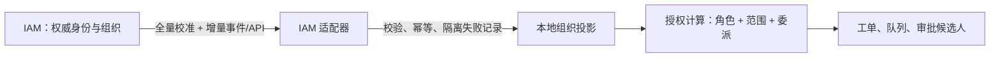

# IAM、流程引擎与协作模型调研及选型

## 1. 流程引擎候选结论

| 方案 | 优点 | 不适合作为本项目一期主引擎的原因 | 结论 |
| --- | --- | --- | --- |
| Flowable OSS | Apache 2.0；可嵌入 Spring Boot；BPMN 2.0、DMN、CMMN、用户任务、多实例与定时器成熟；关系库事务一致性强 | 国产数据库需按目标版本验证方言、驱动与迁移脚本 | **推荐** |
| Camunda 8 | 面向分布式编排和高吞吐服务流程能力强 | 自托管组件更多，运维复杂度、许可模式和信创组件兼容性需逐项审查；对人工作单而言投入偏重 | 二期如出现跨系统长事务/超大事件量后复评 |
| Camunda 7 | 嵌入式模型成熟 | 产品生命周期与后续演进方向不如 Flowable 适合作为新项目基线 | 不选 |
| 自研状态机 | 简单路径性能直接 | 会签、并行、回退、版本迁移、定时和审计会迅速变为高维护成本 | 仅用于非 BPMN 的局部状态校验 |

**推荐方案：** Spring Boot 3.x + Flowable 7.x（上线版本以 POC 锁定）。流程定义使用 BPMN，审批规则、人员候选规则、SLA 和表单配置存于业务配置层，避免把频繁变化的规则硬编码到 BPMN XML。

## 2. 为什么适配本工单场景

- 多人工单可映射为主流程、协办子任务、并行网关和多实例会签，不需要在应用层自行维护大量 token 状态。
- 处理、审批、定时升级和通知可在同一业务事务附近建模；外部调用统一走事件表和异步工作者，避免流程线程被监控或 IAM 服务阻塞。
- 每个服务目录绑定已发布流程版本。旧工单继续按旧版本执行，新工单才进入新版本，保证流程调整可追溯。

## 3. IAM 与组织投影模型

本地数据至少包括：`identity_id`（不可变 IAM 全局 ID）、用户名、姓名、状态、组织编码、组织名称、父组织编码、组织路径、岗位、直属主管标识、同步版本、来源时间和软删除状态。组织使用稳定外部编码和物化路径/层级表优化范围查询；展示名称可变，编码不可复用。

同步规范：

1. 首次全量同步建立基线；随后按变更序列号或更新时间增量同步，并每天做全量校准。
2. 每批数据校验父子关系、编码唯一性、循环引用、字段长度和版本连续性；失败记录进入隔离队列，不中断上一版本的可用组织数据。
3. 人员离职或停用立即撤销登录与新待办领取资格，但保留历史工单显示；调岗影响新授权，进行中的工单责任人不自动替换。
4. 协议实现为 LDAP/AD、OIDC/OAuth 2.0、SAML 2.0 适配器。前期使用账号密码或 LDAP 登录时，密码只由 IAM/目录服务校验；一期后再启用 OIDC/SAML SSO。

## 4. 多人并发控制

工单主记录含 `version` 乐观锁和当前责任快照；所有领取、转派、关闭、重开操作均携带期望版本。处理任务、协办关系、评论、审批快照和交接记录为追加式子记录。业务事件写入事务内 `outbox_event`，由独立工作者投递通知、同步外部平台和更新检索索引，因此重试不会重复改变工单状态。

## 5. 必做 POC

1. 在目标国产 Linux、JDK、CPU 和目标数据库上创建 Flowable 运行库、部署 BPMN、执行会签/并行/定时器/流程迁移。
2. 以 1,000 并发压测建单、抢单、评论、待办查询、组织范围授权和流程任务完成。
3. 验证数据库高可用切换、节点滚动重启、异步事件重复投递、流程定时任务恢复和审计完整性。
4. 使用脱敏 IAM 样本验证 50,000 人、深层组织、调岗、停用、重复事件和故障重放。
