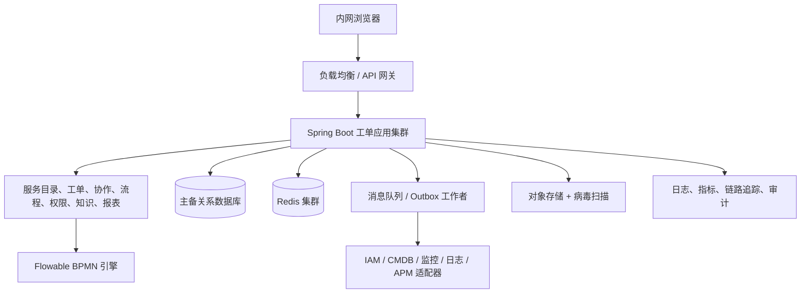

# 总体架构与技术规格说明书

## 1. 架构原则

- 以可靠性、审计和内网可运维性优先于过早服务拆分。
- 所有外部系统通过适配器接入；领域服务不依赖特定 IAM、CMDB、APM 或监控厂商。
- 无状态应用横向扩展；数据库是最终一致性来源；缓存和搜索不可成为写入的唯一依赖。
- 信创兼容以验收过的产品矩阵为准，不以“理论支持”替代 POC。

## 2. 逻辑架构

## 3. 推荐技术基线

| 层级 | 推荐 | 兼容要求 |
| --- | --- | --- |
| 运行时 | Java 21 LTS；若既有信创 JDK 不支持则 Java 17 LTS | 选定国产 JDK、CPU 架构、Linux 发行版执行兼容性/性能 POC |
| 应用 | Spring Boot 3.x、Spring Security、MyBatis/JPA（团队统一一种） | 禁用厂商专有 SQL 与不必要的数据库扩展 |
| 流程 | Flowable 7.x、BPMN 2.0、DMN | 版本和数据库方言在 POC 后冻结 |
| 数据库 | 优先由现有信创目录选型；需要主备、高可用、备份恢复、JDBC 支持 | 候选如 openGauss、达梦、金仓、人大金仓等须以实际版本确认 |
| 缓存/消息 | Redis 兼容集群；国产化目录批准的 MQ | 缓存失效可回源；消息至少一次投递、消费幂等 |
| 文件 | S3 兼容对象存储或批准的分布式文件服务 | 加密、病毒扫描、内容类型白名单、下载鉴权 |
| 运维 | 容器编排优先；无法容器化时 systemd 多实例 | 私有镜像仓库、离线依赖仓库、滚动发布和健康检查 |

## 4. 高可用与容量

- 至少部署两台应用实例、两台异步工作者和高可用数据库；负载均衡健康检查以就绪、存活和依赖降级状态决定摘流。
- 生产、灾备和备份的 RTO/RPO 必须在上线评审前由业务确认；同时确认附件恢复范围、通知最大延迟和演练频率。未确认前不得宣称跨机房容灾；最低要求是可验证的数据库备份、附件备份及恢复演练。
- 采用连接池上限、API 限流、队列背压、分页查询、列表索引和归档策略控制峰值。报表使用汇总表/只读副本，不在主交易库执行大范围实时聚合。
- 观测指标至少包括请求 P50/P95/P99、错误率、队列积压、流程定时任务延迟、同步滞后、数据库连接、慢 SQL、SLA 风险量和外部依赖可用性。

## 5. 安全与等保二级基线

- 访问控制：内网网段/网关控制、MFA 能力预留、最小权限、会话过期、强制注销和管理员双人审批能力。
- 身份安全：不得缓存 IAM 密码；客户端密钥存于受管密钥服务或加密配置；支持密钥轮换。
- 数据安全：TLS 覆盖浏览器到网关及服务间通信；敏感字段按数据分级掩码展示；附件加密存储和下载水印策略可配置。
- 审计安全：登录、授权、导出、配置、流程、工单、附件和集成调用均记录主体、对象、时间、来源 IP、结果、前后摘要和关联请求 ID；导出、批量查询、跨组织查看和附件下载须二次鉴权并记录用途、范围和水印；审计写入与业务数据分权，防篡改与留存周期按制度配置。
- 应用安全：参数化查询、CSRF/XSS 防护、文件内容检测、依赖漏洞扫描、SBOM、离线补丁审批、备份加密与恢复演练。

## 6. 接口原则

所有集成接口应定义 OpenAPI/事件契约、认证方式、超时、重试、限流、幂等键、脱敏字段、错误码和责任人。禁止同步链路串联依赖 IAM、CMDB、监控、日志和 APM；其中任何一项不可用时，人工建单与核心处理不受阻塞。

## 7. 当前 API 与安全实现基线

- 浏览器 API 前缀为 `/api/v1`；写请求使用 CSRF 双提交令牌，工单创建和工作流动作使用幂等键，工作流动作额外使用 HTTP 强 ETag 格式的 `If-Match: "{version}"` 工单版本实现乐观锁，浏览器不得发送未加引号的数值。
- IAM 用户、组织、岗位和平台角色均是本地只读投影；`iam_user_role_projection` 的同步状态是处理人/协办/交接候选资格的服务端证据。任一目标用户未启用或不具备活动支持角色即拒绝操作，不能用浏览器角色字段或前端可见性绕过。
- `GET /tickets` 支持 `queue` 固定队列参数。队列的 IAM 身份、任务候选角色、完成记录、未读通知和 SLA 状态均在服务端解析；对象读取仍逐条执行服务端授权。
- `GET /tickets/{id}/workflow` 是工单详情的授权读模型，返回流程实例、任务、内部评论及可用动作。可用动作仅用于展示；`POST /tickets/{id}/workflow/actions` 会重新校验，不信任该读模型或浏览器传入的处理人、状态、组织和 SLA。该模型中的 `controlledJumpActions` 只面向服务经理/平台管理员返回，用于显示已批准跳转的预演/执行入口；实际 `preflight` 和 `execute` 均再次校验对象范围、管理角色、审批状态、工单/流程版本与当前节点。
- `GET /workflow/approval-tasks` 仅向服务经理/平台管理员开放。它只读取当前 IAM 用户被 Flowable 指派的活动任务，再以申请 ID 关联审批投影并逐项执行关联工单的对象授权；不会以业务投影状态替代引擎任务，也不返回无权任务的全局总数。`canDecide` 只是界面提示，审批写接口仍校验角色、对象范围、冻结人员、实时引擎任务和禁止申请人自审规则。
- 每个审批申请在启动 Flowable 实例前固化审批策略快照：流程键、具体定义 ID/版本、候选角色、**具体 IAM 审批人集合**、决策模式、超时与升级策略版本及捕获时间。申请人会在冻结前剔除，避免自审或全员会签无法完成。实例按定义 ID 而非“当时最新版本”启动；历史行若无可追溯定义 ID 或冻结人员集合只能查看审计，不能再继续审批。审批待办与写入都按冻结人员再次核验，防止后续角色配置漂移扩大旧申请权限。
- 服务系统注册中心使用 `service_system_registry`、`service_system_module` 及系统/模块目录映射表维护支持元数据；CMDB CI 仅以外键只读关联。`ticket_service_system_snapshot` 固化提单时系统、模块、目录和注册版本。系统/模块选择、目录联动和后续一线路由均在服务端重新解析，浏览器不能提交任意映射或历史快照。
- `GET /workflow/definitions` 仅向平台管理员开放，用于核验当前受控应用包已部署的 Flowable 定义键、版本、部署 ID 与时间。它没有 BPMN 上传、部署、覆盖或删除语义；新流程版本仍须经代码审查、BPMN/DMN 校验、数据库迁移、发布审批和回滚演练后随受控制品发布。
- 附件列表、内部评论和 SLA 通过受鉴权的独立读模型获取。附件下载仅对扫描通过文件开放，且下载时再次鉴权。
- 本机开发身份仅在 `local-dev` profile 生效，且仅接受 loopback 请求；生产 profile 保持匿名拒绝，等待 IAM SSO 契约落地。该便利能力不得部署至测试、生产或任何可被局域网访问的环境。
- 工单关系使用独立的受控关系表而非浏览器字段或通用图接口。`GET/POST /tickets/{id}/relations` 对源、目标分别执行对象授权；目标无读取权限时不返回关联摘要。关系写入以 `(源单、目标单、类型)` 自然键去重并保留创建主体、时间与审计请求 ID，不能借此跳过审批、推进状态或泄露跨组织工单。
- 工作流参与人采用独立持久化快照表；主办变更会先失效旧的当前主办，再写入新主办快照，协办按 IAM 用户去重。工作流概览仅回传活动参与人和其历史快照，不以实时 IAM 投影覆盖责任事实。
- 工单生命周期已由 Flowable BPMN 驱动；所有后续可能调整的审批（受控跳转、权限申请、高影响关闭、会签/或签/加签）也必须建模为独立 Flowable BPMN/DMN 流程，平台业务表只保存流程实例映射、审批投影、审计和业务约束。受控跳转已使用并行多实例用户任务：`ANY_ONE` 任一冻结审批人完成即结束并撤销其余任务；`ALL_OF` 仅在全体通过时结束，任一拒绝立即结束。每次完成只追加决策审计，只有 Flowable 实例已结束时才更新申请最终状态；审批通过不会直接执行流程跳转，仍需由独立高风险服务端操作完成预演和执行。
- Flowable 适配器已提供受控活动迁移端口：迁移前必须按流程实例和预期源节点锁定当前任务，迁移仅允许到已发布节点。该端口不直接暴露 HTTP；只能由后续的事务性执行编排服务在审批、预演、对象授权、版本和影响门禁全部通过后调用。

### 7.1 受控跳转执行闭环（当前实现）

`POST /tickets/{ticketId}/workflow/approval-requests/{requestId}/execute` 仅接受服务端已获批、预演可执行的申请，并必须带当前工单 `If-Match` 版本。执行服务会先以 `(申请 ID、APPROVED、申请时工单版本、申请时流程版本)` 原子保留执行权；随后在同一应用事务中迁移 Flowable 活动、将旧平台任务标记为 `CANCELLED`、创建目标节点任务投影、更新工单/流程投影、写入 `EXECUTED` 结果、重算 SLA，并经既有通知 Outbox 以服务端计算的收件人创建消息。重复执行、并发占用、版本变化和节点变化均失败关闭并返回冲突，浏览器不能提交收件人、状态或节点迁移命令。

执行结果投影保留执行人、开始/完成时间、执行前后节点；审批通过与已执行是两个不可混同的状态。发生引擎或执行持久化异常时，系统显式释放开发环境的执行保留、整体回滚生产事务、记录安全审计事件，并以 `503 SERVICE_UNAVAILABLE` 返回可重试的安全摘要；申请保持可重新预演的已通过状态。故障诊断以请求关联 ID 和受控运维日志追踪，不将数据库异常、流程引擎细节或敏感堆栈回显给用户。`V14__controlled_jump_execution_result.sql` 为纯新增可空列和索引，先迁移数据库再发布应用；回退应用版本时该迁移无需删除，禁止为回退而删除已有执行审计数据。

### 7.2 可执行 Jar 的 BPMN 资源兼容性

Flowable 7.2 在部分 JDK/Spring Boot 嵌套 Jar 组合中无法从嵌套资源 URL 解析 BPMN XSD 的相对导入。打包配置会解包 `flowable-bpmn-converter` 依赖，使 XSD 以可解析的常规 URL 提供；不关闭 Flowable 的 XSD、模型或流程语义校验，也不开放运行时上传或任意部署 BPMN。每次构建仍由 `FlowableBpmnSchemaValidationTest` 对所有已发布 BPMN 做 XSD 校验；发布验收还必须包含 `java -jar` 启动冒烟，确保打包产物而非 Maven 类路径可运行。

## 8. 集团数据权限与工单查询目标架构（P0）

本节冻结第一批生产整改的目标边界；详细对象模型、查询约束和验收矩阵见 [`11-集团数据权限与工单查询设计.md`](11-集团数据权限与工单查询设计.md)。在本节门禁完成前，当前基于宽角色再逐对象过滤的实现只能用于受控开发或试点，不能作为集团多组织隔离的生产结论。

### 8.1 服务端授权上下文

- 每个同步 HTTP 请求、异步任务和 Flowable 回调都必须先解析不可由客户端构造的 `AuthorizationContext`。上下文至少包含：IAM 主体、活动状态、平台角色、组织/服务/队列/CI 数据范围、团队队列成员关系、范围版本、解析时间和本次动作。
- 角色只决定“可执行哪类动作”，数据范围和对象关系决定“可操作哪些对象”。`ROLE_PLATFORM_ADMIN`、`ROLE_AUDITOR`、一线/二线支持或服务经理均不得仅凭角色获得全量工单读取、修改、审批、附件下载或导出权限；全局业务范围必须是独立、显式、可审计且可撤销的授权。
- 组织范围默认只匹配精确组织；包含下级必须由授权记录显式声明，并从经过环路校验的 IAM 组织闭包解析。请求参数中的组织、系统、目录、队列或 CI 只能缩小结果，不能扩大上下文。
- 工单读取和动作授权以当前范围为准；提单人、当前主办/协办、被指派的审批/确认任务等直接对象关系只授予该对象所需的最小能力。历史身份、路由和流程快照用于追溯，不能恢复已撤销的当前权限。

### 8.2 SQL 层范围过滤

- 列表、搜索、队列、数量、报表、导出候选集和关联对象查询必须把授权条件与业务筛选共同下推到同一条参数化 SQL；顺序要求是“先授权过滤，再排序和分页”。禁止读取全表后在 Java、前端、缓存或搜索结果中逐条剔除无权对象。
- 对象详情仍执行一次服务端对象授权，但不能以详情鉴权替代集合查询的 SQL 范围条件。无权对象不得通过总数、空页、排序位置、聚合值、关联摘要或响应时间差被枚举。
- SQL 范围谓词使用受控连接、`EXISTS` 或预解析的有界范围集合；不得拼接角色、组织路径、表名、排序表达式或客户端 SQL 片段。范围集合过大时使用受控临时授权表/会话范围表或等价数据库方案，不能生成无界 `IN` 列表。

### 8.3 团队队列

- “个人视图”与“团队队列”分离：`MY_TODO`、`MY_DONE` 等是当前主体派生视图；团队队列是具有稳定编码、所属团队、覆盖组织/服务/系统/目录、成员和生命周期的受控业务资源。
- 新待办进入团队队列时固化队列编码、路由策略版本和候选范围。共享待办仅对当前活动 IAM 用户、活动后台授权、活动团队成员且仍满足对象数据范围的人员可见和可抢；抢单在数据库与 Flowable 任务上使用同一业务意图的原子条件，只有一人成功。
- 团队、队列、成员和覆盖范围变更必须版本化并审计。撤权或离队后立即失去新的查看、抢单和处理资格；已领取工单由主管通过受审计的回收/转派流程处置，不能静默保留宽权限。

### 8.4 数据库分页与稳定排序

- 工单集合接口的生产基线采用服务端不透明游标和键集分页，首批只允许稳定顺序 `created_at DESC, id DESC`；`id` 是唯一兜底排序键。页大小默认 20、最大 100，客户端不得提交任意排序列或表达式。
- 首次查询固化规范化筛选摘要、排序、查询上界时间、授权范围版本和主体；`nextCursor` 必须与这些事实绑定并具有限期。主体、筛选或范围版本变化时旧游标安全失效，客户端从第一页重新读取，不能沿用旧游标扩大权限。
- 默认列表不依赖全表精确总数；需要数量的个人/团队角标使用独立、同范围 SQL 或受控汇总。若 OpenAPI 保留 `total`，其值也必须来自完全相同的授权谓词，并有独立容量门禁，不能先查询全局总数再脱敏。

### 8.5 索引、迁移与容量

- V39 负责第一批工单范围查询组合索引；V40 负责团队/队列及成员关系、任务 `queue_code`、不可变路由快照和相应索引。迁移按“新增可空结构与索引 → 分批回填并校验 → 应用双写/切读 → 收紧约束”执行，禁止在主表高峰期一次性回填或以修改既有迁移文件代替新版本。
- 最小索引族覆盖：工单稳定分页、提单人个人视图、组织/服务目录范围、活动队列任务、处理人已办、SLA 风险以及各授权关系的主体/范围反向查询。最终索引以代表性数据上的 `EXPLAIN ANALYZE`、写放大和存储评估为准，禁止只凭开发小数据量确认。
- 容量基线至少使用 1,000,000 张工单、50,000 个 IAM 身份、500 个服务系统和 500 个团队队列；在 1,000 并发只读负载下，受控列表 P95 小于 1 秒、P99 小于 2 秒、错误率小于 1%，且无全表加载、连接池耗尽、长事务或无界内存增长。

### 8.6 发布门禁

- 安全门禁必须覆盖角色 × 组织 × 服务 × 队列 × CI × 对象关系的允许/拒绝矩阵，以及调岗、停用、撤权、跨组织关联、游标重放、总数和空页枚举。
- 数据门禁必须在真实 MySQL 上验证迁移前后行数、孤儿关系、范围回填、索引选择、分页无重复/遗漏和并发抢单唯一性；H2 或内存仓库结果不能替代。
- 容量门禁必须压测真实 `/tickets`、个人待办、团队队列和数量查询，不得以 `/system/ping` 代替业务查询。测试报告保留数据规模、SQL 计划、P50/P95/P99、错误率、数据库连接、CPU、内存和慢 SQL 证据。

## 9. 团队队列与审批候选目标架构（第二批 P0）

### 9.1 团队队列持久化边界

- `support_team` 是稳定运维责任主体，保存团队编码、名称、所属组织、生命周期和版本；`support_team_member` 保存 IAM 成员、成员角色、有效起止时间和版本，`SUPERVISOR` 只授予该团队队列的治理资格，不自动授予工单业务数据读取。
- `support_queue` 是稳定工作池，绑定一个支持团队并保存队列编码、名称、分派模式、生命周期和版本；`support_queue_scope` 保存组织、服务目录、服务系统和 CI 覆盖范围。同一队列内同类型范围取并集、不同类型取交集，队列命中不能替代当前人员自己的 `TicketAccessScope`。
- 队列路由任务必须在 `ticket_workflow_task.queue_code` 保存当前工作池，并追加不可变路由快照。快照至少固化团队/队列、分派模式、目录节点策略版本、队列版本、范围摘要、候选角色/成员集合、目标 `TicketObjectContext` 摘要和捕获时间；后续改名、改范围、离队或停用不得重写历史快照。

### 9.2 共享领取与成员收敛

- 共享领取的数据库条件必须一次性比较：任务仍未领取、任务/工单/流程预期版本、活动 `queue_code`、当前 IAM 活动状态、后台启用状态、活动支持角色、成员有效期以及当前 `TicketAccessScope` 对目标 `TicketObjectContext` 的命中。只有数据库 CAS 成功者才可在同一事务推进 Flowable、主办投影、SLA、审计和通知。
- 成员离队、有效期结束、IAM 停用或后台撤权后立即失去团队目录、未领取列表、候选展示和领取资格。已领取任务不得静默保留或自动转给任意成员；系统标记责任风险，由仍有效且有范围的队列主管执行受审计的回收、转派或交接。
- 队列停用后不得承接新任务，也不得继续领取未领取任务。已有未领取任务进入受控迁移/恢复清单；已有主办任务保留责任事实，但处理人每次动作仍重新校验当前角色和数据范围。

### 9.3 生命周期审批与受控跳转候选

- 生命周期审批和受控跳转在创建申请时，先读取目标工单的服务端 `TicketObjectContext`，再将策略角色池依次收敛为：活动 IAM 用户、活动后台授权、当前候选角色、当前 `TicketAccessScope` 命中、职责分离通过且不是申请人。只有这个结果可以冻结到申请和 Flowable 任务；角色池人数不能作为可审批人数。
- 展示审批待办时必须同时满足：当前 Flowable 活动任务、主体属于冻结候选集合、主体当前 IAM/后台角色仍有效、主体当前 `TicketAccessScope` 仍命中目标工单。失权任务不展示、不计数，也不因后来扩大角色池而新增旧申请候选人。
- 提交决定时再次读取目标 `TicketObjectContext` 并重新解析候选人的当前 `TicketAccessScope`；冻结候选身份只证明创建时资格，不能替代当前授权。调岗、撤权、范围变化、工单范围变化或任务变化均安全拒绝并记录稳定原因码。

### 9.4 V40 迁移原则

- V40 仅前向新增团队、成员、队列、队列范围、不可变任务路由快照，以及节点路由策略/工作流任务所需的 `queue_code` 与索引；不得修改 V1–V39，也不得删除既有角色/范围/路由审计数据。
- `queue_code` 先以可空方式扩展并双写。只有能从已发布目录 × 节点策略确定唯一队列的历史活动任务才允许分批回填；不确定任务必须标记为待治理，不得落入“全局默认队列”。完成空值、孤儿、重叠范围、成员有效期和快照一致性校验后，才可切换团队队列读路径并按任务类型收紧约束。
- 应用回退保留 V40 新结构和快照；恢复发布采用前向修复。真实 MySQL 必须演练扩展、回填、双写、切读和旧应用兼容，不能以 H2 自动建表结果替代。

## 10. 队列命令幂等与受控迁移架构（第三批 P0 / V42）

### 10.1 队列命令幂等

- V42 新增 `support_queue_command_idempotency`。自然键为 `(actor_iam_user_id, idempotency_key)`，并固化 `operation`、资源类型/编码、规范化请求指纹、处理状态、响应状态与脱敏响应摘要、创建/完成/过期时间。幂等键不能跨主体、操作或队列复用。
- 非过期记录收到相同主体、操作、资源和指纹时返回第一次稳定结果；同键不同绑定返回冲突；`IN_PROGRESS` 返回处理中冲突或受控重试提示，不能并行执行第二次命令。失败必须区分可重试和最终失败，重试不能绕过原始授权、版本和迁移计划校验。
- TTL 仅决定何时可由受控清理任务归档/删除幂等记录，不表示客户端可在过期瞬间安全重放高风险命令。清理需保留审计关联，响应摘要不得保存成员隐私、附件、密钥或完整异常。

### 10.2 不可变迁移计划

- `support_queue_migration_plan` 固化源/目标队列、两端版本与范围摘要、申请人、预演时间、任务统计、审批事实和计划状态；`support_queue_migration_plan_item` 逐任务固化任务/工单/流程版本、领取状态、主办、源队列、目标队列、路由快照引用、处置类型和交接清单摘要。
- 计划与明细中的预演业务字段创建后不可修改。计划表仅允许以 CAS 推进生命周期状态、执行租约和安全结果；任务结果通过受控结果字段或追加事件记录，不能覆盖预演时的任务版本、领取状态和范围证据。
- 状态机固定为 `PREFLIGHTED → APPROVED → EXECUTING → COMPLETED | FAILED`；预演过期、队列/范围/任务版本变化进入 `STALE`，未执行计划可 `CANCELLED`。申请人不得批准自己的计划，批准不等于执行。

### 10.3 停用与执行语义

- 预演必须证明替代队列活动且在组织、服务目录、服务系统、CI 各范围类型上均为源队列的超集；缺失任一源范围、范围语义不兼容或目标即源队列均阻断。预演逐任务冻结当前版本、状态、领取人、工单/流程版本和现有路由快照。
- 未领取任务执行迁移时以 `(任务 ID、源 queue_code、OPEN、assignee IS NULL、任务版本、工单/流程版本)` 原子 CAS；成功后写目标 `queue_code`、新任务版本、迁移结果、追加路由/迁移快照和审计。任一条件变化不得误迁移为成功。
- 在办任务不自动转队列、不改变主办、不重置 SLA。每张在办任务生成不可变 handover checklist，至少包含当前主办、未完事项、SLA 风险、交接目标队列、主管责任人、截止时间和原路由快照；后续逐单走交接/转派流程。
- 只有全部未领取任务完成迁移、全部在办任务生成交接清单且阻断项为零时，计划才可完成并将源队列推进到相应停用状态。部分失败保持可诊断状态，不宣称队列已安全停用。

### 10.4 重试与并发

- 同一源队列同一时刻最多存在一个 `PREFLIGHTED/APPROVED/EXECUTING` 活动计划，由数据库唯一约束或等价原子门禁保证。执行权使用计划状态、预期版本和有期限租约原子认领，节点故障后仅过期租约可由合格主体恢复。
- 重试逐明细读取原始任务快照和已有结果：已成功项返回原结果，不重复迁移、通知或审计；未开始/可重试失败项重新执行全部当前授权和 CAS；最终失败项必须重新预演或人工处置。
- 并发领取、任务完成、再次停用、第二个迁移计划和重复执行互相竞争时，以任务/计划 CAS 唯一结果为准。客户端超时不能推断失败，必须用原幂等键查询或重放以取得稳定结果。

### 10.5 数据库发布门禁

- 必须在真实 MySQL 分别验证全新空库顺序执行 V1–V42、当前历史基线导入后升级至 V42，以及包含真实规模 V40 队列/任务/快照数据的存量库升级。Flyway 历史、校验和、外键、唯一键和字符集必须一致。
- 保存幂等键查找、活动计划互斥、计划明细分页、未领取任务 CAS、在办清单和清理任务的 `EXPLAIN ANALYZE`；不得出现无界主表扫描、长事务回填或按计划逐条 N+1 查询。
- V42 只允许新增表、列、约束和索引。应用回退保留 V42 数据并关闭新命令入口；已处于 `EXECUTING` 的计划先停止新认领并按租约恢复策略收敛，禁止删除计划/幂等记录或编辑 Flyway 历史伪造回退。

## 11. 幂等租约与结果对账架构（第四批 P0 / V43）

### 11.1 V43 数据扩展

- V43 为 `support_queue_command_idempotency` 新增 `lease_owner`、`lease_expires_at`、`attempt_count`、`key_version`、`result_resource_type` 和 `result_resource_id`。租约所有者是受控应用实例/执行标识，不是浏览器主体；所有时间使用数据库 UTC 时间。
- `result_resource_type/id` 只引用稳定业务结果，例如队列编码或迁移计划 ID；响应摘要继续只保存资源版本、计划版本、状态和安全结果码，不保存成员、范围、原因、附件或异常正文。
- V43 只做前向可空扩展、回填和索引，不改写 V42 已有命令绑定、指纹和响应事实。历史终态记录可按结果摘要回填资源引用；无法证明的记录保持空值并只允许原终态重放。

### 11.2 Reserve CAS 与租约接管

- 首次请求原子插入 `IN_PROGRESS`，写入主体、键、操作、资源、HMAC 指纹、当前 `key_version`、`lease_owner`、租约到期时间和 `attempt_count=1`。唯一键仍为 `(actor_iam_user_id, idempotency_key)`。
- 同键同绑定且租约未过期时明确返回处理中冲突及受控 `Retry-After`，不能启动第二次业务事务；同键异绑定始终冲突。
- 租约过期不直接授权重做。接管者必须先依据 `result_resource_type/id` 及操作对应的业务自然键查询业务结果：若结果已经存在且与主体、操作、资源和请求指纹一致，则只补全幂等终态；若不存在，才以 `(主体, 键, IN_PROGRESS, 旧 lease_owner, lease_expires_at < DB_NOW, version)` 执行 CAS 接管，更新租约并递增尝试次数。
- 已存在但无法证明属于本命令的业务结果、资源版本不相容或结果引用冲突时进入最终失败/人工治理，禁止覆盖或再次执行。

### 11.3 业务提交与幂等完成

- 队列/迁移计划业务写入与幂等 `SUCCEEDED` 完成应尽量使用同一数据库事务，并在终态记录中保存稳定结果资源类型/ID。业务事务失败不得写成功幂等记录，幂等完成失败不得回滚或重做已经可证明提交的业务事实。
- 对无法完全同事务覆盖的外部/Flowable 步骤，业务结果表必须保存命令关联或稳定自然键。恢复路径先对账业务结果，再补写幂等终态；任何恢复都不能调用“重新创建/重新迁移”来探测是否成功。
- 响应前进程崩溃的场景必须能由结果资源重建安全响应摘要。相同资源已存在时返回第一次事实，不新增第二个队列、计划、任务迁移、交接清单、通知或审计事件。

### 11.4 HMAC 指纹与密钥轮换

- 请求指纹采用 `HMAC-SHA256(受管密钥, 规范化请求字节)`，覆盖主体绑定之外的操作、资源、版本、原因、替代队列、计划和全部业务字段。规范化必须固定 Unicode、空白、时间、数字、对象键和无序集合顺序，且不包含 Cookie、CSRF、请求 ID 或传输层差异。
- HMAC 密钥只来自受管密钥系统/部署 Secret，不进入数据库、日志、审计或响应；数据库仅保存非敏感 `key_version`。生产缺少活动密钥、密钥不足 32 字节或版本重复时启动失败。
- 轮换采用双读单写：新命令只用当前活动版本写入；校验/重放可按记录 `key_version` 使用当前及受批准的上一版本读取。旧版本只能在不存在活动租约、相关幂等记录均终态或超过最长保留期后退役，不能通过切换密钥使旧命令重新执行。

### 11.5 回退边界

- 回退 V43 应用前停止新命令接管，等待活动业务事务结束，并对仍在租约中的命令执行结果对账。旧 V42 应用可忽略新增列，但不得在无法理解 V43 活动租约时重新开放队列写入口。
- V43 表结构和结果引用在应用回退后保留；禁止删除列、清空租约或修改历史 HMAC 指纹。恢复使用前向修复，并继续保留当前/上一版本密钥直至所有旧记录可安全重放或归档。

## 12. 历史幂等记录治理（第五批 P0 / V44）

### 12.1 历史分类与不可执行标记

- V44 禁止 `support_queue_command_idempotency.key_version` 为 `NULL`。V43 之前生成、无法证明使用当前规范化 HMAC 的记录统一写入非密钥标记 `LEGACY_UNVERIFIABLE`；该值不在受管 key ring 中，也不能映射为当前/上一版本密钥。
- 历史 `SUCCEEDED` 且存在可验证强 `result_resource_type/id` 的记录迁移为 `LEGACY_RESULT_ONLY`。它只允许当前主体在重新授权后查询命令状态和结果资源引用，不允许 payload/响应摘要重放，也不能重新进入执行、租约接管或幂等完成路径。
- 历史 `SUCCEEDED` 无强结果引用、历史 `IN_PROGRESS` 以及任何无法证明业务结果的记录迁移为 `RECONCILIATION_REQUIRED`，清除活动执行语义并进入人工对账。历史失败状态统一收敛为 `FAILED_FINAL`，不得因升级获得可重试资格。

### 12.2 指纹与重放隔离

- 旧 SHA-256、未知算法或 `key_version=NULL` 的 `request_fingerprint` 不能用当前 HMAC key ring 验证，不能重新计算后覆盖，也不能通过“碰巧相等”升级为可重放命令。
- `LEGACY_RESULT_ONLY` 仅以数据库迁移时冻结的主体、操作、资源和强结果引用作为只读证据；客户端再次提交相同 Idempotency-Key 必须返回明确的历史只读状态，引导按资源查询，不返回原 payload，也不调用业务服务。
- `RECONCILIATION_REQUIRED` 只能由具备当前管理范围的治理人员通过独立审计流程处置。对账可确认结果引用或最终失败，但不能把历史指纹改造成 HMAC 指纹、恢复租约或自动执行原命令。

### 12.3 V44 迁移步骤

1. 上线前暂停队列写命令和租约接管，统计 `NULL key_version`、各状态、强结果引用和异常绑定数量并保存审计摘要。
2. 将有强结果引用的历史成功记录转换为 `LEGACY_RESULT_ONLY`，清空可重放响应正文，仅保留最小状态、资源引用和原审计关联。
3. 将历史进行中、成功但无强引用及不确定记录转换为 `RECONCILIATION_REQUIRED`，清除 `lease_owner/lease_expires_at` 的执行含义；历史失败转换为 `FAILED_FINAL`。
4. 为全部历史非 HMAC 记录写入 `LEGACY_UNVERIFIABLE`，验证无 `NULL key_version` 后收紧非空约束，并扩展状态检查约束。
5. 运行治理校验：任何 `LEGACY_*` 或 `RECONCILIATION_REQUIRED` 记录均不得出现在活动租约、接管扫描、可重试或 payload 重放查询中；通过后才重新开放 V44 写入口。

### 12.4 生产启动与回退

- 生产启动必须验证 Flyway 已到 V44、`key_version IS NULL` 数量为零、历史不可验证记录均处于非执行状态、活动 HMAC 版本存在且密钥满足长度要求。任一检查失败即拒绝开放队列写接口。
- 升级报告必须记录迁移前后各分类数量、强引用验证结果、异常记录 ID 摘要、操作人、审批人和时间；不得在日志或报告中保存原 payload、密钥或完整响应。
- V44 应用回退前关闭队列写入、状态重放和租约接管。旧应用若不理解 `LEGACY_RESULT_ONLY/RECONCILIATION_REQUIRED`，不得重新开放命令入口；V44 状态、非空约束和治理审计必须保留，只能以前向修复恢复。

## 13. 附件恶意内容扫描生产架构（第六批 P0）

### 13.1 环境边界与启动门禁

- 附件上传默认执行“先隔离、后扫描、再放行”。跳过扫描的实现只允许在 `local-dev` profile 注册，并且仅用于本机开发数据；测试、预生产、生产及任何可被局域网访问的环境均不得通过配置开关、空实现或失败降级绕过扫描。
- 生产环境必须存在由平台配置并通过启动探测的受管扫描器 Bean。缺少扫描器、配置不完整、目标不可解析或启动探测失败时，应用拒绝启动或保持附件写入口关闭，不能把文件标记为清洁，也不能退化为本地 bypass。
- 扫描器地址、端口、连接/读取超时、单次最大响应字节和允许的文件上限由受管配置提供。生产禁止客户端传入扫描地址，禁止任意 DNS/端口、Unix 命令执行或把扫描器凭据写入日志；应用到扫描服务的网络策略只放行批准的主机和端口。

### 13.2 ClamAV INSTREAM 适配器

- 生产适配器通过受控 TCP 连接调用 ClamAV `INSTREAM`，按协议发送命令、多个“4 字节网络序长度 + 数据块”以及长度为零的终止块。分块读取，不为扫描复制完整文件到堆内存；累计输入不得超过附件上限，单块大小固定且受控。
- 连接建立、写入、读取和总扫描时间均有独立上限；响应读取到协议终止符或最大响应字节即停止。超长、截断、非预期编码、多行注入、未知状态和附带额外内容均按协议错误处理，不继续信任该连接。
- 仅接受严格的 `...: OK` 为 `CLEAN`、`...: <signature> FOUND` 为 `FOUND`、ClamAV 明确 `ERROR` 为扫描错误。网络异常、超时、协议错误、扫描器过载或解析异常统一映射为 `SCAN_FAILED`，保存稳定原因码和关联请求 ID，不向用户回显扫描器地址、病毒特征全文或内部异常。

### 13.3 清洁区、隔离区与下载语义

- 新上传内容先进入隔离区并处于 `PENDING_SCAN`；隔离对象使用不可预测存储键、服务端加密和最小权限凭据，不能获得浏览器直链、预签名下载地址、预览、正文解析、知识索引或下游分发能力。
- `CLEAN` 后以受控的服务端操作进入清洁区或切换为清洁对象引用，并原子记录扫描引擎/签名库版本、扫描时间、文件摘要和审计事实；只有清洁状态与清洁区对象同时成立，且下载时对象授权再次通过，才允许下载。
- `FOUND` 保持在隔离区并标记拒绝/隔离；`SCAN_FAILED` 保持在隔离区等待受控重扫或运维处置。任何非 `CLEAN`、状态与存储区不一致、摘要变化或扫描证据缺失均失败关闭。删除、重扫、误报放行和证据留存按安全制度执行，普通业务管理员不得直接将隔离文件改为清洁。
- 文件状态变更、隔离/清洁对象搬运和数据库提交失败时不得产生“数据库已清洁但对象仍隔离”或相反的可下载窗口；采用幂等状态机、对象摘要校验和补偿任务收敛，补偿期间始终按隔离处理。

### 13.4 可观测性与故障处置

- 监控扫描请求量、`CLEAN/FOUND/SCAN_FAILED` 比例、响应耗时、超时、协议错误、隔离积压、重扫次数、签名库版本/更新时间和清洁区不一致数量；告警不得携带附件正文、文件内容或用户敏感信息。
- 扫描服务不可用时继续保护既有清洁附件的授权下载，但新上传文件保持隔离；积压恢复使用限速、幂等重扫，不能绕过扫描批量放行。扫描器切换或签名库回退需审批、审计和抽样复验。

## 14. 前端体验支撑与流程产品化首批架构

### 14.1 Capabilities 驱动的导航与动作

- 登录后导航、工作台入口、角标和对象动作由服务端返回的 `capabilities` 决定，前端不再用角色名称、组织名称、菜单硬编码或历史缓存推断权限。能力采用稳定编码，并区分平台级入口能力、范围化集合能力和具体对象动作。
- `capabilities` 是展示提示，不是授权凭证。每次列表、详情、下载和写动作仍以当前 IAM 主体、后台角色、`TicketAccessScope`、对象上下文和版本在服务端重新鉴权；客户端伪造、保留或放大能力编码不能改变结果。
- 能力响应携带授权摘要版本、生成时间和可选失效时间。角色、范围、团队成员或对象关系变化后，旧能力缓存失效；无法加载能力时只保留安全的个人入口和重新认证，不展示后台入口或猜测权限。

### 14.2 Dashboard 只读模型

- Dashboard 使用专用只读模型，不拼接多个全局计数后由浏览器扣减。每个卡片或指标都绑定当前主体可见范围、稳定查询定义和服务端授权谓词，数量与下钻列表使用同一范围语义。
- 响应至少包含 `scopeDigest`、`asOf`、各指标 `availability` 和数据口径版本；`asOf` 表示聚合事实的数据时点，不能伪装为实时。部分数据源失败时按指标返回 `AVAILABLE/DEGRADED/UNAVAILABLE` 和安全原因码，禁止用零值冒充真实数量。
- Dashboard 仅提供只读导航和下钻提示，不产生领取、审批、转派或批量处置权限。下钻时重新校验当前范围；范围版本变化、快照过期或指标不可用时刷新模型，不沿用旧数量推断无权数据。

### 14.3 草稿存储边界

- 浏览器草稿只允许保存低敏表单输入、当前步骤、选定目录/系统稳定编码和表单 schema 版本；不得保存附件字节、附件预签名地址、IAM/OIDC token、Cookie、CSRF 值、幂等密钥、内部评论、候选人全集或服务端授权上下文。
- 附件一旦选择即走受鉴权的服务端隔离上传；浏览器草稿只保存无下载能力的临时附件引用和显示名。服务端草稿绑定创建主体、组织范围、目录、schema 版本、乐观版本和 TTL，读取/更新/提交均重新鉴权，过期或撤权后失败关闭。
- 浏览器存储不可作为业务事实、审批证据或恢复凭据；清理浏览器数据不得导致已提交工单丢失，跨设备恢复只来自服务端草稿。敏感字段若尚未具备服务端受控草稿能力，只允许会话内存暂存并明确提示用户。

### 14.4 表单 Schema、步骤元数据与兼容

- 每个已发布服务目录版本绑定不可变 `formSchemaId@version`。Schema 只描述受支持的字段类型、校验、显示条件、默认值来源和敏感级别，不允许脚本、表达式执行、远程组件 URL 或浏览器自行提交服务端字段。
- 步骤元数据稳定定义 `stepCode`、顺序、标题、字段集合、进入/完成条件和可选帮助引用；步骤只组织交互，不改变字段授权、工单状态或流程节点。服务端对最终提交使用所绑定 schema 重复校验并忽略/拒绝未发布字段。
- 已创建草稿和工单继续引用当时 schema 版本；新版本发布不原地改写历史。兼容升级必须定义字段新增、弃用、只读展示和草稿迁移规则；无法确定转换时要求用户基于新版本显式重建，不静默丢字段。

### 14.5 目录—流程版本映射与发布包草案

- 建立“服务目录发布版本 → 表单 schema 版本 → 已部署 BPMN/DMN 定义 ID 与版本 → 首节点/路由策略版本”的显式映射。建单时固化映射和流程定义事实，历史实例不随目录或流程后续发布漂移。
- 首批发布包只定义受管元数据草案：包 ID/版本、目录版本、schema 版本、流程定义引用、路由/SLA 引用、兼容说明、校验结果、申请/复核/发布时间和审计摘要。生命周期为 `DRAFT → VALIDATED → PUBLISHED → RETIRED`，发布后不可修改，只能新增版本。
- 首批不实现浏览器低代码 BPMN/DMN/schema 文件上传、任意流程部署或动态脚本执行。流程资源仍由代码仓库、构建校验和受控发布流水线部署；发布包只引用已验证资源，不能绕过 XSD/语义、安全、职责分离和回退评审。
