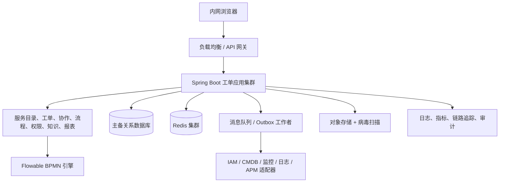

# 总体架构与技术规格说明书

## 1. 架构原则

- 以可靠性、审计和内网可运维性优先于过早服务拆分。
- 所有外部系统通过适配器接入；领域服务不依赖特定 IAM、CMDB、APM 或监控厂商。
- 无状态应用横向扩展；数据库是最终一致性来源；缓存和搜索不可成为写入的唯一依赖。
- 信创兼容以验收过的产品矩阵为准，不以“理论支持”替代 POC。

## 2. 逻辑架构

## 3. 推荐技术基线

| 层级 | 推荐 | 兼容要求 |
| --- | --- | --- |
| 运行时 | Java 21 LTS；若既有信创 JDK 不支持则 Java 17 LTS | 选定国产 JDK、CPU 架构、Linux 发行版执行兼容性/性能 POC |
| 应用 | Spring Boot 3.x、Spring Security、MyBatis/JPA（团队统一一种） | 禁用厂商专有 SQL 与不必要的数据库扩展 |
| 流程 | Flowable 7.x、BPMN 2.0、DMN | 版本和数据库方言在 POC 后冻结 |
| 数据库 | 优先由现有信创目录选型；需要主备、高可用、备份恢复、JDBC 支持 | 候选如 openGauss、达梦、金仓、人大金仓等须以实际版本确认 |
| 缓存/消息 | Redis 兼容集群；国产化目录批准的 MQ | 缓存失效可回源；消息至少一次投递、消费幂等 |
| 文件 | S3 兼容对象存储或批准的分布式文件服务 | 加密、病毒扫描、内容类型白名单、下载鉴权 |
| 运维 | 容器编排优先；无法容器化时 systemd 多实例 | 私有镜像仓库、离线依赖仓库、滚动发布和健康检查 |

## 4. 高可用与容量

- 至少部署两台应用实例、两台异步工作者和高可用数据库；负载均衡健康检查以就绪、存活和依赖降级状态决定摘流。
- 生产、灾备和备份的 RTO/RPO 必须在上线评审前由业务确认；同时确认附件恢复范围、通知最大延迟和演练频率。未确认前不得宣称跨机房容灾；最低要求是可验证的数据库备份、附件备份及恢复演练。
- 采用连接池上限、API 限流、队列背压、分页查询、列表索引和归档策略控制峰值。报表使用汇总表/只读副本，不在主交易库执行大范围实时聚合。
- 观测指标至少包括请求 P50/P95/P99、错误率、队列积压、流程定时任务延迟、同步滞后、数据库连接、慢 SQL、SLA 风险量和外部依赖可用性。

## 5. 安全与等保二级基线

- 访问控制：内网网段/网关控制、MFA 能力预留、最小权限、会话过期、强制注销和管理员双人审批能力。
- 身份安全：不得缓存 IAM 密码；客户端密钥存于受管密钥服务或加密配置；支持密钥轮换。
- 数据安全：TLS 覆盖浏览器到网关及服务间通信；敏感字段按数据分级掩码展示；附件加密存储和下载水印策略可配置。
- 审计安全：登录、授权、导出、配置、流程、工单、附件和集成调用均记录主体、对象、时间、来源 IP、结果、前后摘要和关联请求 ID；导出、批量查询、跨组织查看和附件下载须二次鉴权并记录用途、范围和水印；审计写入与业务数据分权，防篡改与留存周期按制度配置。
- 应用安全：参数化查询、CSRF/XSS 防护、文件内容检测、依赖漏洞扫描、SBOM、离线补丁审批、备份加密与恢复演练。

## 6. 接口原则

所有集成接口应定义 OpenAPI/事件契约、认证方式、超时、重试、限流、幂等键、脱敏字段、错误码和责任人。禁止同步链路串联依赖 IAM、CMDB、监控、日志和 APM；其中任何一项不可用时，人工建单与核心处理不受阻塞。

## 7. 当前 API 与安全实现基线

- 浏览器 API 前缀为 `/api/v1`；写请求使用 CSRF 双提交令牌，工单创建和工作流动作使用幂等键，工作流动作额外使用 HTTP 强 ETag 格式的 `If-Match: "{version}"` 工单版本实现乐观锁，浏览器不得发送未加引号的数值。
- IAM 用户、组织、岗位和平台角色均是本地只读投影；`iam_user_role_projection` 的同步状态是处理人/协办/交接候选资格的服务端证据。任一目标用户未启用或不具备活动支持角色即拒绝操作，不能用浏览器角色字段或前端可见性绕过。
- `GET /tickets` 支持 `queue` 固定队列参数。队列的 IAM 身份、任务候选角色、完成记录、未读通知和 SLA 状态均在服务端解析；对象读取仍逐条执行服务端授权。
- `GET /tickets/{id}/workflow` 是工单详情的授权读模型，返回流程实例、任务、内部评论及可用动作。可用动作仅用于展示；`POST /tickets/{id}/workflow/actions` 会重新校验，不信任该读模型或浏览器传入的处理人、状态、组织和 SLA。该模型中的 `controlledJumpActions` 只面向服务经理/平台管理员返回，用于显示已批准跳转的预演/执行入口；实际 `preflight` 和 `execute` 均再次校验对象范围、管理角色、审批状态、工单/流程版本与当前节点。
- `GET /workflow/approval-tasks` 仅向服务经理/平台管理员开放。它只读取当前 IAM 用户被 Flowable 指派的活动任务，再以申请 ID 关联审批投影并逐项执行关联工单的对象授权；不会以业务投影状态替代引擎任务，也不返回无权任务的全局总数。`canDecide` 只是界面提示，审批写接口仍校验角色、对象范围、冻结人员、实时引擎任务和禁止申请人自审规则。
- 每个审批申请在启动 Flowable 实例前固化审批策略快照：流程键、具体定义 ID/版本、候选角色、**具体 IAM 审批人集合**、决策模式、超时与升级策略版本及捕获时间。申请人会在冻结前剔除，避免自审或全员会签无法完成。实例按定义 ID 而非“当时最新版本”启动；历史行若无可追溯定义 ID 或冻结人员集合只能查看审计，不能再继续审批。审批待办与写入都按冻结人员再次核验，防止后续角色配置漂移扩大旧申请权限。
- `GET /workflow/definitions` 仅向平台管理员开放，用于核验当前受控应用包已部署的 Flowable 定义键、版本、部署 ID 与时间。它没有 BPMN 上传、部署、覆盖或删除语义；新流程版本仍须经代码审查、BPMN/DMN 校验、数据库迁移、发布审批和回滚演练后随受控制品发布。
- 附件列表、内部评论和 SLA 通过受鉴权的独立读模型获取。附件下载仅对扫描通过文件开放，且下载时再次鉴权。
- 本机开发身份仅在 `local-dev` profile 生效，且仅接受 loopback 请求；生产 profile 保持匿名拒绝，等待 IAM SSO 契约落地。该便利能力不得部署至测试、生产或任何可被局域网访问的环境。
- 工单关系使用独立的受控关系表而非浏览器字段或通用图接口。`GET/POST /tickets/{id}/relations` 对源、目标分别执行对象授权；目标无读取权限时不返回关联摘要。关系写入以 `(源单、目标单、类型)` 自然键去重并保留创建主体、时间与审计请求 ID，不能借此跳过审批、推进状态或泄露跨组织工单。
- 工作流参与人采用独立持久化快照表；主办变更会先失效旧的当前主办，再写入新主办快照，协办按 IAM 用户去重。工作流概览仅回传活动参与人和其历史快照，不以实时 IAM 投影覆盖责任事实。
- 工单生命周期已由 Flowable BPMN 驱动；所有后续可能调整的审批（受控跳转、权限申请、高影响关闭、会签/或签/加签）也必须建模为独立 Flowable BPMN/DMN 流程，平台业务表只保存流程实例映射、审批投影、审计和业务约束。受控跳转已使用并行多实例用户任务：`ANY_ONE` 任一冻结审批人完成即结束并撤销其余任务；`ALL_OF` 仅在全体通过时结束，任一拒绝立即结束。每次完成只追加决策审计，只有 Flowable 实例已结束时才更新申请最终状态；审批通过不会直接执行流程跳转，仍需由独立高风险服务端操作完成预演和执行。
- Flowable 适配器已提供受控活动迁移端口：迁移前必须按流程实例和预期源节点锁定当前任务，迁移仅允许到已发布节点。该端口不直接暴露 HTTP；只能由后续的事务性执行编排服务在审批、预演、对象授权、版本和影响门禁全部通过后调用。

### 7.1 受控跳转执行闭环（当前实现）

`POST /tickets/{ticketId}/workflow/approval-requests/{requestId}/execute` 仅接受服务端已获批、预演可执行的申请，并必须带当前工单 `If-Match` 版本。执行服务会先以 `(申请 ID、APPROVED、申请时工单版本、申请时流程版本)` 原子保留执行权；随后在同一应用事务中迁移 Flowable 活动、将旧平台任务标记为 `CANCELLED`、创建目标节点任务投影、更新工单/流程投影、写入 `EXECUTED` 结果、重算 SLA，并经既有通知 Outbox 以服务端计算的收件人创建消息。重复执行、并发占用、版本变化和节点变化均失败关闭并返回冲突，浏览器不能提交收件人、状态或节点迁移命令。

执行结果投影保留执行人、开始/完成时间、执行前后节点；审批通过与已执行是两个不可混同的状态。发生引擎或执行持久化异常时，系统显式释放开发环境的执行保留、整体回滚生产事务、记录安全审计事件，并以 `503 SERVICE_UNAVAILABLE` 返回可重试的安全摘要；申请保持可重新预演的已通过状态。故障诊断以请求关联 ID 和受控运维日志追踪，不将数据库异常、流程引擎细节或敏感堆栈回显给用户。`V14__controlled_jump_execution_result.sql` 为纯新增可空列和索引，先迁移数据库再发布应用；回退应用版本时该迁移无需删除，禁止为回退而删除已有执行审计数据。

### 7.2 可执行 Jar 的 BPMN 资源兼容性

Flowable 7.2 在部分 JDK/Spring Boot 嵌套 Jar 组合中无法从嵌套资源 URL 解析 BPMN XSD 的相对导入。打包配置会解包 `flowable-bpmn-converter` 依赖，使 XSD 以可解析的常规 URL 提供；不关闭 Flowable 的 XSD、模型或流程语义校验，也不开放运行时上传或任意部署 BPMN。每次构建仍由 `FlowableBpmnSchemaValidationTest` 对所有已发布 BPMN 做 XSD 校验；发布验收还必须包含 `java -jar` 启动冒烟，确保打包产物而非 Maven 类路径可运行。
