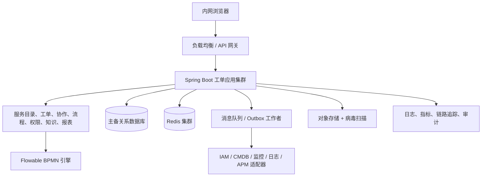

# 总体架构与技术规格说明书

## 1. 架构原则

- 以可靠性、审计和内网可运维性优先于过早服务拆分。
- 所有外部系统通过适配器接入；领域服务不依赖特定 IAM、CMDB、APM 或监控厂商。
- 无状态应用横向扩展；数据库是最终一致性来源；缓存和搜索不可成为写入的唯一依赖。
- 信创兼容以验收过的产品矩阵为准，不以“理论支持”替代 POC。

## 2. 逻辑架构

## 3. 推荐技术基线

| 层级 | 推荐 | 兼容要求 |
| --- | --- | --- |
| 运行时 | Java 21 LTS；若既有信创 JDK 不支持则 Java 17 LTS | 选定国产 JDK、CPU 架构、Linux 发行版执行兼容性/性能 POC |
| 应用 | Spring Boot 3.x、Spring Security、MyBatis/JPA（团队统一一种） | 禁用厂商专有 SQL 与不必要的数据库扩展 |
| 流程 | Flowable 7.x、BPMN 2.0、DMN | 版本和数据库方言在 POC 后冻结 |
| 数据库 | 优先由现有信创目录选型；需要主备、高可用、备份恢复、JDBC 支持 | 候选如 openGauss、达梦、金仓、人大金仓等须以实际版本确认 |
| 缓存/消息 | Redis 兼容集群；国产化目录批准的 MQ | 缓存失效可回源；消息至少一次投递、消费幂等 |
| 文件 | S3 兼容对象存储或批准的分布式文件服务 | 加密、病毒扫描、内容类型白名单、下载鉴权 |
| 运维 | 容器编排优先；无法容器化时 systemd 多实例 | 私有镜像仓库、离线依赖仓库、滚动发布和健康检查 |

## 4. 高可用与容量

- 至少部署两台应用实例、两台异步工作者和高可用数据库；负载均衡健康检查以就绪、存活和依赖降级状态决定摘流。
- 生产、灾备和备份的 RTO/RPO 必须在上线评审前由业务确认；同时确认附件恢复范围、通知最大延迟和演练频率。未确认前不得宣称跨机房容灾；最低要求是可验证的数据库备份、附件备份及恢复演练。
- 采用连接池上限、API 限流、队列背压、分页查询、列表索引和归档策略控制峰值。报表使用汇总表/只读副本，不在主交易库执行大范围实时聚合。
- 观测指标至少包括请求 P50/P95/P99、错误率、队列积压、流程定时任务延迟、同步滞后、数据库连接、慢 SQL、SLA 风险量和外部依赖可用性。

## 5. 安全与等保二级基线

- 访问控制：内网网段/网关控制、MFA 能力预留、最小权限、会话过期、强制注销和管理员双人审批能力。
- 身份安全：不得缓存 IAM 密码；客户端密钥存于受管密钥服务或加密配置；支持密钥轮换。
- 数据安全：TLS 覆盖浏览器到网关及服务间通信；敏感字段按数据分级掩码展示；附件加密存储和下载水印策略可配置。
- 审计安全：登录、授权、导出、配置、流程、工单、附件和集成调用均记录主体、对象、时间、来源 IP、结果、前后摘要和关联请求 ID；导出、批量查询、跨组织查看和附件下载须二次鉴权并记录用途、范围和水印；审计写入与业务数据分权，防篡改与留存周期按制度配置。
- 应用安全：参数化查询、CSRF/XSS 防护、文件内容检测、依赖漏洞扫描、SBOM、离线补丁审批、备份加密与恢复演练。

## 6. 接口原则

所有集成接口应定义 OpenAPI/事件契约、认证方式、超时、重试、限流、幂等键、脱敏字段、错误码和责任人。禁止同步链路串联依赖 IAM、CMDB、监控、日志和 APM；其中任何一项不可用时，人工建单与核心处理不受阻塞。
