# 工单业务流程设计

## 1. 通用处理流程

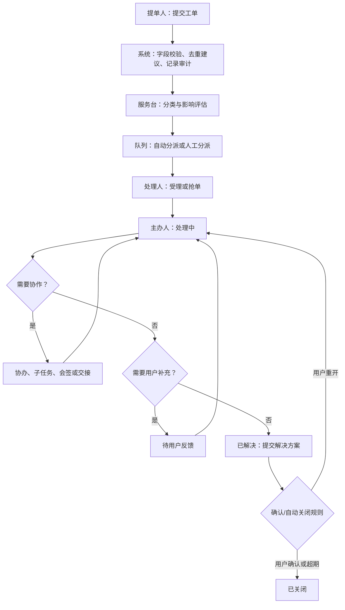

所有箭头都是受策略控制的状态转换：权限、必填信息、审批规则、SLA、审计原因和通知模板必须在转换执行时校验。不能用直接修改状态字段绕过流程。

### 1.1 请求人三步建单流程

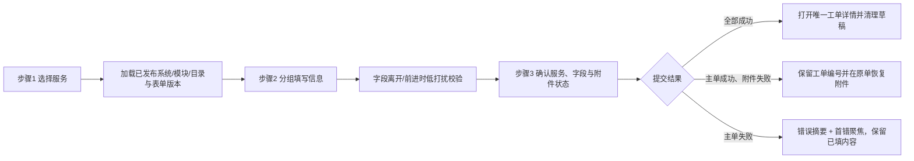

安全草稿在可持久化字段变化 2 秒后防抖写入当前标签页会话存储，并绑定 IAM 主体及组织、目录和表单版本；页面载入时只提示恢复，不静默应用。首期只恢复系统/目录及明确非敏感的布尔、枚举、日期选项；主题、自由正文、自定义标签、附件及文件名、临时图片 URL、凭据和受控候选数据不进入持久化草稿。未来服务端草稿接入后以版本/更新时间对账，不覆盖较新草稿。

字段按用户任务分组，条件字段在触发时出现并解释原因；隐藏字段不提交。校验从字段首次离开或用户前进开始，输入中防抖且不抢焦点。最终提交失败时汇总服务端错误并聚焦首个可修复项；未保存离开提示只在确有脏数据、待上传附件或未处理恢复草稿时出现。

三步流程在移动端按单列顺序显示，底部动作不遮挡字段；键盘 Tab 顺序与视觉顺序一致，Esc/返回不会静默丢弃，Enter 只在明确的最终提交控件生效。主单和附件结果分离，附件失败永远回到原工单处理。

## 2. 责任规则

| 场景 | 责任人变化 | 必填记录 | SLA 处理 |
| --- | --- | --- | --- |
| 自动分派 | 队列成为责任方，尚无个人主办人 | 命中规则、候选队列、时间 | 首响计时继续 |
| 抢单/受理 | 领取人变为主办人 | 原子领取结果、处理组 | 首响完成；解决计时继续 |
| 转派 | 目标队列/人员获得责任 | 转派原因、前后处理人、目标确认 | 是否暂停/重算由服务目录规则决定 |
| 添加协办 | 主办人不变 | 协办任务、目标、期限 | 主单继续；协办可有子 SLA |
| 并行子任务 | 主办人不变 | 子任务输入、汇聚规则 | 以主单 SLA 为主，子任务风险预警 |
| 交接班 | 接班人变为主办人 | 交接摘要、未完事项、接班确认 | 连续计时，不因交接重置 |
| 挂起 | 主办人保留 | 挂起原因、恢复时间/事件 | 仅允许符合目录规则的原因暂停 SLA |
| 升级 | 主办人保留，增加升级责任方 | 级别、原因、通知和决策 | 触发升级计时与主管可见性 |

## 3. 多人处理状态模型

### 3.1 主办与协办

- 每张主工单任意时刻只能有一名主办人，主办人负责对外回复、状态迁移和关闭质量。
- 协办人针对可验收的协作事项提交结论；主办人可采纳、退回或继续补充。协办完成不等同于主单解决。
- 主办人离岗或权限失效时，队列主管应在设定时限内转派；系统告警但不擅自将责任交给任一候选人。

### 3.2 并行与会签

- **并行处理**适用于网络、应用、数据库等同时排查。流程汇聚之前不允许把主单标为已解决，除非配置为“任一分支满足即可”。
- **会签**用于关闭高影响事故、权限敏感服务或需要多专业确认的事项。会签成员在任务创建时固化，支持全部通过、比例通过和任一否决；否决必须附原因并进入返工路径。
- **或签**适用于值班组/角色池，第一名领取并完成者使其余候选任务失效；避免多人重复审批。

### 3.3 评论与可见性

公开回复面向提单人和订阅者，内部评论仅对处理组、协办人、审批人和具有数据范围权限的主管可见。附件沿用评论或工单的最高保密级别；下载应二次鉴权并记录审计。

### 3.4 团队队列处理流程

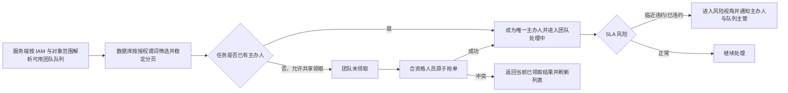

个人待办回答“当前用户现在可以做什么”，团队队列回答“当前获授权团队承担什么责任”。同一工单可以同时出现在主办人的个人待办和团队处理中，但不得同时出现在团队未领取；队列视角不创建新的业务状态，也不改变 SLA。队列数量、列表和导出必须使用同一授权、状态和 SLA 谓词。

队列主管拥有监督、受控分派、回收和升级能力，不自动获得正文、附件或跨组织处理权限；具体能力仍由服务、队列、CI、数据密级和对象状态共同决定。普通候选人只能领取服务端明确返回为可领取的任务，不能通过修改队列或人员参数领取其他团队工单。

#### 3.4.1 队列配置、成员与停用流程

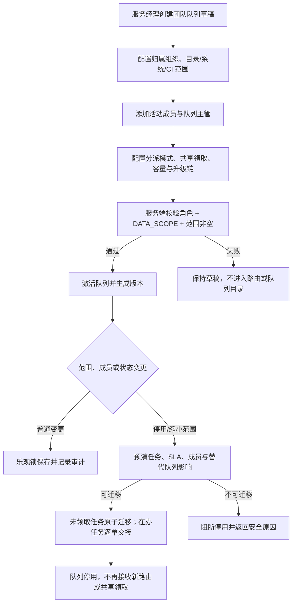

成员资格按 IAM 用户 ID、成员类型、有效期和队列版本保存。IAM 用户停用、成员到期或其角色/数据范围不再命中时，新的候选和领取资格立即失效；系统不得自动把在办责任转交给任意成员，而应进入主管工作台的待处置清单。共享领取还需同时满足活动节点策略、队列开关、对象范围和容量限制，任一条件不满足均不展示领取能力。

主管工作台不是集团总览。它只汇总当前主体明确管理队列的未领取、处理中、SLA 风险、超容量、停滞和待交接事项，并提供受控分派、回收、升级和成员配置入口。所有卡片与下钻列表复用相同授权谓词、队列版本和查询快照；空 `DATA_SCOPE` 返回空工作台且不提供写动作。

旧队列在补齐可信归属组织、非空目录范围、活动成员和主管之前标记为 `MIGRATION_PENDING`，不得接收新路由、开放共享领取或进入主管汇总。既有在办工单继续保留原队列、主办和 SLA 快照，只允许当前仍具对象权限的主体处理；迁移通过双人复核后发布新队列版本，不能直接改写历史责任记录。

#### 3.4.2 写操作幂等与停用计划状态机

所有队列后台写操作先登记 `Idempotency-Key` 与规范化请求指纹，再进入权限、范围、版本和状态校验。同键同指纹返回首次执行的等价结果；同键异指纹返回 409。幂等记录区分“接收但未执行、执行中、已完成、可重试失败、不可重试失败”，从而使网关超时和客户端重试不会产生第二个计划、审批流程或迁移批次。

`IN_PROGRESS` 不是要求客户端换键重试的错误，而是可查询的执行状态。响应只提供资源/计划引用、首次接收/心跳/租约到期时间和安全建议；客户端保留原键并查询状态。执行节点按租约心跳续期，其他节点在租约有效期内只读；租约过期后仅一个节点可通过数据库 CAS 接管，旧租约持有者后续写入必须失败。

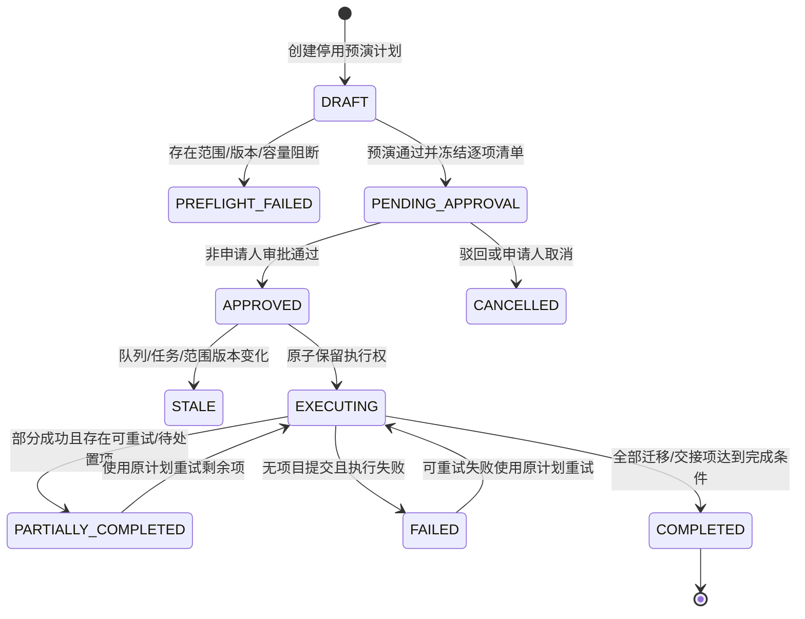

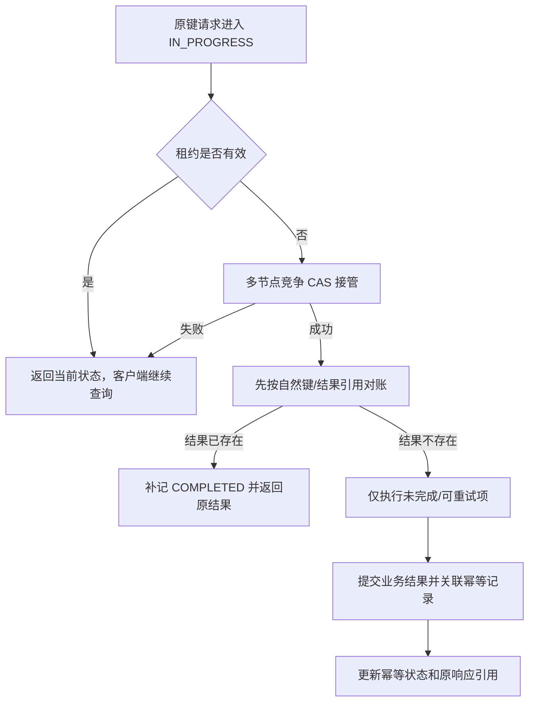

停用执行按冻结清单逐项编排：

1. 创建计划时冻结源队列版本、替代队列、申请人、原因、组织/目录范围和查询快照，并为每张受影响工单生成稳定计划项 ID。
2. 未领取项保存源任务/工单期望版本和目标队列，执行时原子迁移；在办项只创建交接待办，保留当前主办和 SLA，不以队列停用直接完成交接。
3. 计划审批冻结候选、审批结论和清单哈希；任何关键版本变化使批准计划失效。
4. 执行以计划级原子保留防止并发，以计划项状态防止重复副作用。成功项永久保存结果引用；可重试失败项记录安全原因和下次尝试，重试不得重新处理成功项。
5. 所有迁移项成功且所有在办项已生成有效交接任务后，才提交源队列停用。部分完成时源队列保持受控过渡状态，不接收新路由，但仍可查询计划和处理剩余责任。

业务结果已提交但进程在写入幂等 `COMPLETED` 前崩溃时，接管节点必须先通过计划项自然键、唯一迁移事件/交接任务和审计关联识别已有结果，补全幂等状态并返回首次结果；不能把 `IN_PROGRESS` 或心跳丢失直接解释为业务失败。无法验证结果归属时进入人工可审计状态，不继续写业务。

规范化请求指纹完全由服务端使用 HMAC 计算，客户端只持有 `Idempotency-Key`。幂等记录固化 HMAC 密钥版本；轮换期间旧记录继续使用旧版本验证，新记录使用当前版本，比较采用常量时间。任何密钥加载或版本校验异常均关闭式失败并先执行结果对账，不能把 HMAC 降级为客户端摘要、普通哈希或“暂时不校验”。

#### 3.4.3 历史幂等记录分流

历史记录进入新幂等执行器前先检查是否存在可信 HMAC 指纹、密钥版本、租约和业务结果唯一关联。任一关键证据缺失时不进入自动重放/接管流程，而是只读分流：

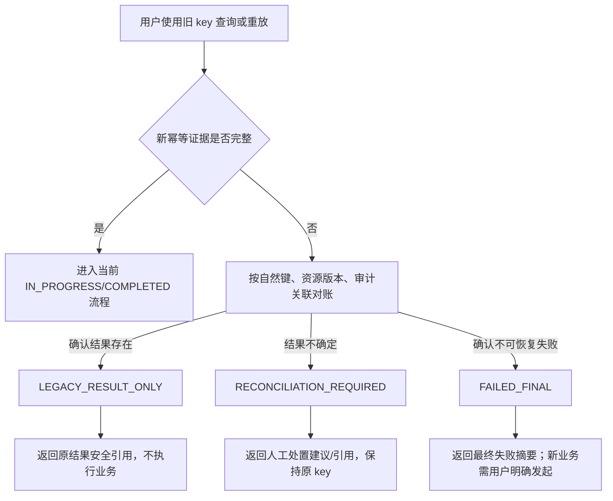

`LEGACY_RESULT_ONLY` 只证明已有结果可使用，不证明旧请求满足新指纹规范；系统不能据此生成伪 HMAC。`RECONCILIATION_REQUIRED` 表示未知而非失败，任何自动换 key、重新迁移或重新交接都被禁止。`FAILED_FINAL` 表示该旧业务意图已终止，客户端仍不得自动重试；只有用户在理解结果后明确创建新的业务意图，才由新请求生成新 key。

人工处置由有权队列管理人员发起并要求复核，保存对账证据、业务结果/缺失结果、结论和审计。处置只追加状态与安全引用，不覆盖旧记录、伪造指纹、删除旧错误或回写历史业务事件。其他主体查询旧 key 继续按防枚举规则返回统一不可见结果。

管理页面通过计划查询接口展示状态，而不是从停用请求的 HTTP 结果推断最终状态。页面需展示影响摘要、审批、阻断项和逐项结果，并按服务端能力显示“提交审批、执行、重试失败项、取消”；本批允许先提供 API，UI 未完成前不开放生产停用入口。

### 3.5 跨组织协作流程

跨组织协办、交接和转派必须从当前工单发起，不能先扩大人员目录或组织数据范围再选择对象。服务端先校验发起人的对象动作权限，再按服务目录、目标队列、专业角色、值班状态和数据密级返回最小候选集合；浏览器不能提交候选人的角色、组织归属或数据范围。

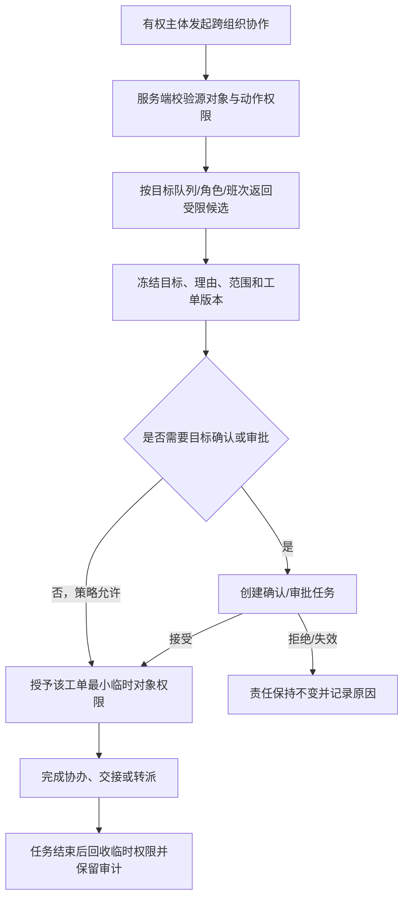

- 协办只获得指定协办任务、必要正文、允许附件和内部评论权限，不获得来源组织队列浏览权；主单关闭权仍归主办人或服务端策略指定主体。
- 交接接受前原主办人继续负责，接受后责任和后续 SLA 归属原子切换；拒绝、超时、人员停用或版本变化均不产生半完成责任关系。
- 转派到其他组织时必须确认目标队列可承接该服务和数据密级。转派成功后来源团队是否保留只读权限由服务目录策略决定，不能默认保留跨组织访问。
- 跨组织候选数量、无候选原因和目标组织结构只返回完成当前动作所需的安全摘要；所有成功、拒绝和越权尝试写入不可修改审计。
- 在可版本化、可撤销的临时对象授权记录尚未实现前，跨组织参与关系本身不能绕过当前数据范围；相关协办、交接和转派安全拒绝。不得为了让流程“可点通”而恢复宽角色权限。

### 3.6 待办查询与翻页一致性

待办查询先在数据库中应用当前主体授权范围和固定队列语义，再应用筛选、稳定排序和游标边界。第一批默认按不可变创建时间和稳定工单编号倒序；游标绑定主体、队列、筛选、排序、授权版本和查询快照。客户端切换队列、修改筛选或主动刷新时必须开始新快照，不能继续使用旧游标。

在同一快照内，新建或更新工单不得插入已经读取的页序列；权限撤销立即生效，被撤销对象即使位于旧快照的后续页也不得返回。页面必须区分“没有匹配记录”“没有该队列权限”和“队列服务不可用”，但错误文案不能暴露无权数据是否存在。

### 3.7 知识草稿、导入与发布授权流程

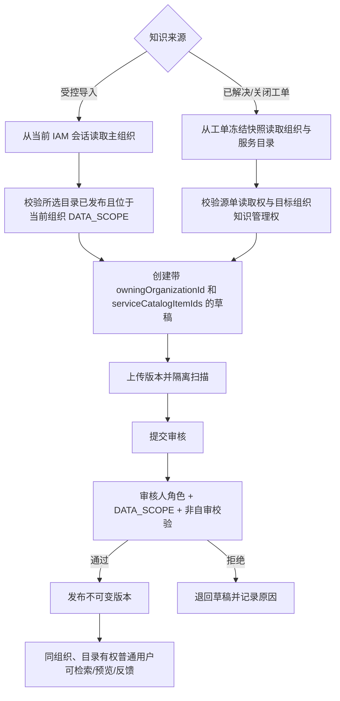

知识文档和版本必须保存 `owningOrganizationId` 与非空 `serviceCatalogItemIds`。从工单创建时两者只能继承源工单冻结快照；导入时组织只能取服务端当前 IAM 主组织，目录只能从服务端授权选项中选择并再次校验。任何来源的组织或目录为空、目录失效、主体角色不足或 `DATA_SCOPE` 不命中时不创建草稿，也不以平台组织、管理员组织或全局目录兜底。

普通用户只读取当前 IAM 组织已发布且目录可见的知识。管理人员执行上传版本、提交审核、审核、发布、归档、复审或从工单生成草稿时，必须具有 `ROLE_SERVICE_MANAGER` 或 `ROLE_PLATFORM_ADMIN`，并命中目标 `owningOrganizationId` 的组织数据范围；`ROLE_AUDITOR` 仅能在范围内读取审计元数据。知识列表、详情、版本历史、审核队列、正文/附件预览、复审候选、反馈提交与反馈计数使用同一组织/目录/状态谓词。

### 3.8 旧知识迁移与关闭式失败

旧知识迁移分为盘点、映射、校验、预演、执行和抽样复核。迁移工具只能依据受控的来源工单快照、原目录映射或经双人复核的组织/目录映射表填充归属；禁止根据作者姓名、文件夹、标题、标签或当前操作者猜测组织。迁移事件保存旧记录 ID、目标组织、目录集合、映射依据、执行人、复核人、时间和结果。

缺少可信 `owningOrganizationId`、缺少 `serviceCatalogItemIds`、目录已失效、映射存在歧义或组织不在当前迁移授权范围内的记录进入 `MIGRATION_PENDING`，仅有权审计主体可见元数据。普通列表、审核队列、版本、预览、附件和反馈全部关闭式拒绝；不能为了保持历史访问量而临时发布为全局知识。

### 3.9 角色默认工作台与状态降级

服务端根据当前角色、队列成员/主管关系和 DATA_SCOPE 返回可用工作台及推荐默认项；浏览器只保存已授权视图的显示偏好。提单人默认我发起，一线默认个人待办/团队未领取，二线默认专业待办，主管默认队列风险，服务经理默认运营视图，审计员默认只读审计，平台管理员默认配置治理且无范围不显示业务汇总。

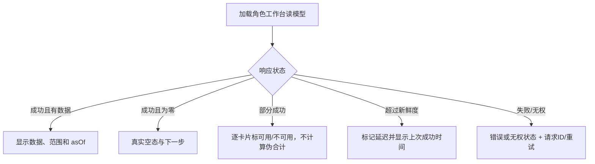

空态只来源于成功的零结果；错误、无权、超时和延迟不能转换为零或健康。旧数据显示时必须带上次成功时间并与实时数据视觉区分。每个数量下钻复用相同主体、范围、筛选和快照；任一子读模型失败不改变其他模块，但整体不得得出“平稳”结论。

## 4. 页面卡顿专项流程

专项字段应支持“未知/未采集”，不应阻断用户提交。处理人通过报告链接、Trace ID、日志检索条件定位证据；工单仅保存必要摘要和链接。涉及用户标识、IP、Cookie、URL 参数或业务数据时，应按数据分级脱敏后展示和导出。

### 4.1 附件隔离、扫描与重试流程

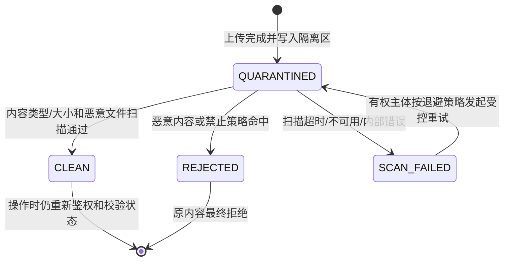

上传接口成功仅表示字节已进入隔离区，不表示可用。服务端先以内容签名识别真实类型、校验大小与哈希，再调用受管扫描器；扫描回执必须关联稳定附件 ID、内容哈希、扫描器配置版本和时间。浏览器不参与扫描、不能提交状态，也不能把本地预览当作服务端 `CLEAN`。

所有消费入口统一执行“对象权限 + 最新扫描状态为 `CLEAN` + 内容未撤销”的门禁。下载、内联图片、正文替换、知识正文预览、文本抽取、索引、案例匹配和知识版本发布任一入口都不能单独放宽。`QUARANTINED`、`SCAN_FAILED`、`REJECTED`、未知状态和无扫描证据均关闭式拒绝。

`SCAN_FAILED` 的重试由服务端按能力开放：先校验对象范围、隔离文件存在且哈希未变、状态仍为失败、重试次数、退避时间和扫描器健康，再用附件 ID 与尝试序号的自然键创建唯一任务。并发或同键重放返回同一任务；成功后才转 `CLEAN`，失败则保留 `SCAN_FAILED` 和脱敏原因。`REJECTED` 不重扫原内容；用户若重新上传，必须创建新附件并完整重走隔离流程。

页面状态流为“上传中 -> 已隔离待扫描 -> 扫描通过/扫描失败/已拒绝”。页面轮询或手动刷新服务端状态，非 `CLEAN` 不生成下载与预览链接；只有服务端能力允许时显示重试，并展示次数/退避提示。工单和附件采用分离结果：工单已创建后附件失败，页面保留工单编号和各附件状态，不重复提交主单。

## 5. 异常与回退规则

| 异常 | 系统规则 |
| --- | --- |
| 误分类/误分派 | 保留历史分类和责任链；重新分类后按规则重新路由，不能覆盖旧记录 |
| 用户长期未回复 | 待反馈超期自动提醒；自动关闭前按目录配置保留期，关闭后允许有限期限内重开 |
| 处理人无响应 | 触发队列提醒、主管升级或自动回收到队列；不删除已产生的处理记录 |
| 外部平台不可用 | 工单核心流程继续；集成事件进入重试/人工补偿队列，并向处理人展示降级状态 |
| 流程配置发布错误 | 新实例停止进入该版本；运行中实例按已发布版本继续，管理员用受审计的迁移方案处理 |

## 6. 流程治理

每一个服务目录流程都需要流程负责人、BPMN 定义、表单版本、审批策略、SLA 规则、权限范围、异常分支和测试用例。流程发布采用草稿、评审、发布、废弃四态，生产中禁止直接编辑已发布版本。

当前平台提供仅限平台管理员读取的 Flowable 定义登记视图，用于核验正在运行的流程键、引擎版本和部署时间；该视图不是低代码发布入口。BPMN/DMN 文件、表单/策略版本和数据库迁移必须由受控制品一起评审、签名、发布和回滚，运行中实例继续引用其已启动的引擎定义，不会被“发布最新版”直接改写。

事件工单发起页另提供一个面向已登录用户的**只读生命周期预览**：服务端只从当前已部署的 `servicehubTicketLifecycle` Flowable 定义提取允许展示的节点和顺序连线，用于降低提交前的流程理解成本。该接口不返回 BPMN XML、部署标识、任意流程查询能力或实例操作入口；预览不会创建实例、候选人或审批任务，提交成功后才按固化的定义 ID 与版本真正启动流程。

发起页的必填校验由页面先提示并定位到首个缺失字段，服务端仍是最终字段/版本/权限校验方。正文图片可在编辑器内本地预览，但创建请求只携带安全占位文本；工单创建后才以受控上传接口保存图片，并将占位替换为经过对象鉴权的附件 URL。浏览器不得提交 Base64、Blob URL、外部图片 URL 或任意附件地址作为最终工单正文。

### 6.1 受控跳转与流程迁移

允许使用可视化流程图选择目标节点，但“可视化”不等于任何人可任意跳转。跳转操作仅面向流程负责人、具备数据范围的平台管理员和应急授权人员；按目录和风险级别要求单人或双人审批。系统在沙箱中预演目标节点、将撤销或保留的任务、重新生成的候选人、SLA/OLA 影响、通知和关联审批，再由后端一次性执行。

跳转只能发生在已发布 BPMN 中声明的可达纠偏节点，不能跳过硬性审批/会签、身份授权、风险确认或结束节点。执行时需取消或完成原任务的处置记录，重新计算目标节点权限与候选人，保持主单 SLA 连续计时；所有历史任务、原分支、原因和审批均保留。流程版本迁移采用同样的受控机制，运行中实例不可被前端或数据库直接修改。

### 6.2 双方确认交接班

交接班属于责任主体变更，不能由当前主办人单方完成。发起时服务端校验目标人员处于启用状态、具备活动支持角色且可处理目标工单；随后固化申请人、接班人、理由、当前工单版本与流程版本，并按固化的 Flowable 定义启动 `servicehubHandoverConfirmation`。

只有被冻结的接班人完成确认任务、且工单/流程版本仍与申请快照一致时，系统才原子更新主办关系并写入协作快照、流程事件、审计和通知。接班人拒绝、人员失效、对象越权或任一版本变化时，申请进入拒绝或失效状态，既不修改主办人也不回写历史身份。浏览器只能展示服务端给出的可确认任务，不能提交任意接班人、流程定义、版本或最终处理状态。

### 6.3 高风险生命周期动作审批

挂起、升级、撤销和重开暂按“先审批、后执行”处理。处理人提交动作时，平台不会更改工单状态、SLA 或流程实例，而是创建独立审批申请并启动 `servicehubLifecycleActionApproval`。申请固化审批人候选集合、具体 BPMN 定义版本、动作与理由、申请人、工单版本和工作流版本；浏览器无法传入状态、执行人、候选人或流程定义。

审批人必须同时属于冻结候选集合并具有当前工单的对象审批权限，申请人不可自审。流程结束为通过后，服务端才以申请快照重新校验工单和流程版本并执行动作；发生并发处理、调岗导致授权失效或版本变化时，申请标记为失效且不产生状态改变。这个审批模型与受控跳转隔离，未来可按服务目录扩展关闭、解决、分派等动作及会签/超时策略，而不能通过直接更新业务表绕过流程。

当前已纳入该模型的动作包括挂起、升级、撤销、重开、分派、受理、解决和关闭。分派申请额外冻结目标 IAM 用户；目标人员不得审批自己的分派申请，批准前系统不写主办关系、不创建已分派待办，也不通知其“已接单”。

### 6.4 协办确认与时效代理

添加协办同样不是单方授权：主办或服务经理申请后，系统冻结协办候选人、工单/流程版本与理由，并启动 `servicehubCohandlerConfirmation`。只有目标人员完成确认且版本未变化时才加入协办关系；拒绝、越权、停用或版本失效均不产生协办权限。

代理是受时效限制的操作授权，而非职责转移。仅当前主办可指定一名活跃支持人员为本工单代理，不能代理给自己，最长有效期为 30 天。每个动作重新校验委托人、代理人、当前时间、IAM 支持角色与对象权限；代理不替代主办身份，也不能绕过生命周期或审批 Flowable 流程。

## 7. 重大事件与关联对象

P1 不使用普通工单的线性升级替代。达到服务目录 P1 阈值后，系统在主工单上创建重大事件上下文，固化事件指挥官、技术主责、业务沟通人、记录员、影响范围和通报节奏；恢复后才进入关闭确认与 PIR。事件可关联多个告警、CI、问题单和紧急变更，但各对象保持自己的状态与审批规则。

服务请求、权限申请、事件、问题和变更采用不同的服务目录与表单。普通请求可以按服务目录串行审批；权限申请必须使用授权人和有效期规则；事件以恢复服务为目标；问题负责根因与已知错误；变更负责实施窗口、风险、回退和审批。它们通过关联关系协同，而非把所有动作塞进一个状态机。

### 7.1 关联工单控制流程

关联由已授权用户在源工单中发起，填写目标工单完整编号并选择受控类型：普通关联、重复于、父工单、关联问题或关联变更。服务端先确认源单可修改，再确认目标单对当前用户可读；任一条件不成立即拒绝，页面和错误响应均不得返回目标单摘要。普通关联以稳定编号顺序规范化并按自然键去重，避免正反两次操作生成重复边；其他方向性关系保留发起方向。关系只表达协同和追踪，不会自动合并、关闭、转派、继承审批或改变 SLA；如需转换/合并，必须走后续独立的受控流程。每次成功建立均记录主体、两端编号、类型、时间和请求关联 ID。

## 8. 当前工作流实现约束

当前实现使用 Flowable BPMN 生命周期和平台侧工作流投影共同驱动状态。工单详情先读取授权后的工作流概览，服务端据当前 IAM 身份、主办/协办关系、任务候选资格及工单状态返回可用动作；浏览器只显示该结果。

事件工单在提单时已经选择服务目录/系统，因此 MySQL 运行路径默认不再要求人工“分类、分派”：服务端按 `目录 × accept 节点` 的路由策略，从该策略的启用 IAM 一线角色池随机选择人员，提单人被强制排除，随后工单直接进入 `PENDING_ACCEPTANCE`。每次进入节点都会固化分派模式、角色池、策略版本与已选人员快照。策略可设为系统分派或上一节点处理人指定，但发起人永远没有指定处理人的接口；无合格候选人时保留受控待办且写入审计，不能降级误派管理员。

系统与模块选择是路由前置条件：已发布服务系统 → 活动模块/页面 → 模块级或系统级服务目录映射 → 已发布节点路由策略。系统级和模块级目录映射都必须由后台治理，且模块级优先；提单创建后写入不可变系统快照。共享待办模式下不预分配主办人，符合角色池的人员可原子抢单；上一节点指定仅在已有处理人推进至下一处理节点时开放，受理首节点不允许提单人指定。

动作提交时服务端仍会重新执行对象授权、流程状态迁移、目标 IAM 用户启用状态、目标活动支持角色和工单版本比对。`CLAIM` 为原子抢单；`ASSIGN`、`TRANSFER`、`ADD_COHANDLER`、`HANDOVER` 仅提交候选 IAM ID，候选人必须来自只读 IAM 角色投影，不能由浏览器指定或伪造角色、组织、流程节点或最终数据范围。受控跳转始终是独立申请/审批能力：工单详情仅对服务经理或平台管理员返回每个已批准申请的服务端计算管理能力；普通用户、处理人和只读人员既看不到预演/执行入口，也不能通过直接调用接口绕过授权。

当前详情页的“协作人员”来自工作流参与人快照：抢单、分派、转办、协办写入时均从 IAM 只读投影中提取姓名、组织和主岗；后续 IAM 调岗不会回写这些记录。当前仅显示仍有效的主办/协办，历史主办变动通过流程事件和审计记录追溯。

受控跳转申请现作为独立审批申请记录返回工单详情，字段包括申请人、源/目标节点、理由、状态和申请时间。该读模型只展示真实的 `PENDING_APPROVAL` 等状态；在审批决策和受控执行服务落地前，系统不会把流程事件、评论或普通动作伪装为审批结论。

审批决策必须由独立 Flowable 审批流程承载，而不是依赖业务表状态机：受控跳转申请创建前，服务端先解析一个已发布的具体 BPMN 定义 ID 和版本，并冻结候选审批角色、**具体 IAM 审批人**、决策模式、超时/升级策略版本与捕获时间；申请人从候选集合剔除。随后只能按该定义 ID 启动实例，避免“取到版本 A、启动时变成版本 B”。后续发布、角色映射或策略变更不改写该快照。当前 `servicehubControlledJumpApproval` 以并行多实例用户任务处理冻结人员：部署受控策略解析为 `ANY_ONE` 时任一审批通过/拒绝即结束并撤销其他任务；解析为 `ALL_OF` 时全体通过才结束，任一拒绝立即结束。模式只能由服务端部署配置 `SERVICEHUB_CONTROLLED_JUMP_ALL_OF_TARGET_NODES` 按目标节点解析，浏览器、URL、请求体和管理页面均不能选择。每次完成先追加不可变决策记录，只有 Flowable 实例结束时才把申请投影落为 `APPROVED` 或 `REJECTED`。未保存具体定义 ID 或冻结人员集合的历史记录仅可审计展示，禁止继续审批。审批通过仅表示获得后续受控执行资格，不会直接修改 BPMN 节点、工单状态、SLA 或处理人；执行前仍需进行目标节点白名单、实例版本、未完成任务、候选人和影响预演校验。平台现提供只读预演接口，核验审批结论、申请时固化的工单/流程版本、当前源节点、目标白名单和目标差异；任一项变化即返回阻断原因，且预演不调用 Flowable 状态迁移、不更新工单、不发送通知。预演只返回目标候选角色及候选人重算策略：提单人节点重新验证身份快照，处理节点在执行时按当前 IAM 角色池和值班数据范围重算；预演不返回或冻结具体处理人。

审批待办只能从 Flowable 的活动**已指派任务**读取，并以审批申请 ID 关联平台投影后逐条复核工单对象权限；不能因为业务表中仍有 `PENDING_APPROVAL` 记录就将其展示为可处理任务。只有冻结 IAM 审批人且持有服务经理/平台管理员角色才能看到自己的任务；申请人不生成审批任务，提交接口也会再次拒绝自审。待办响应不返回总数量，以免借由数量、分页或空页枚举无权工单。

每个引擎审批任务完成后，平台额外追加不可变的审批决策记录，包含审批申请、Flowable 任务 ID、审批人、结论、理由与时间；它不是审批状态机，也不替代 Flowable 的活动任务。多实例会签/或签按每个实例任务追加记录，最终状态完全以 Flowable 进程是否结束及其结论为准；冻结集合以 IAM 用户 ID 去重，因而一个用户不能完成另一个人的实例任务。比例通过、加签、代理、超时/升级仍属于后续受控 BPMN/DMN 版本，未实现前不得以业务表或前端逻辑替代。

当预演通过且具备服务经理/平台管理员对象权限时，受控执行服务先将申请从 `APPROVED` 原子保留为 `EXECUTING`，因此相同申请无法并发或重复执行；随后一次性迁移 Flowable 活动、取消源任务投影、创建目标任务、更新工单/流程版本、重算 SLA 和通知收件人，并落为 `EXECUTED`。执行记录保存执行人、开始/完成时间和源/目标节点；详情页将“审批通过”和“已执行”分别展示。详情页的管理弹窗必须先调用只读预演，再允许二次确认执行；其返回的展示能力不能替代写接口的再次授权、审批、版本和节点检查。任一编排步骤失败时事务整体回滚，开发内存实现也会显式释放执行保留；页面收到 `503 SERVICE_UNAVAILABLE` 的安全可重试摘要，完整诊断保留在审计与运维日志中。执行入口仍是后端受控接口，普通用户和仅能查看详情的人员没有页面按钮或绕过路径。

### 8.1 本地多身份回归边界

为验证提单、处理、审批三个主体的服务端授权边界，本地 `mysql,local-dev` 配置可在回环地址上通过固定身份选择器运行 `requester`、`first-line`、`service-manager` 和 `admin` 四个夹具。选择器只映射到代码中固定的 IAM 用户与角色，未知值不降级为管理员并由安全链拒绝；每个主体独立获取 CSRF 会话。该能力不传输 IAM 用户 ID、角色、组织范围或密码，且生产 profile 不加载此过滤器，真实环境必须由 IAM/SSO 提供认证与授权上下文。

## 9. 第一批 P0 流程验收

| 场景 | 前置条件 | 预期结果 |
| --- | --- | --- |
| 团队队列下钻 | 主管被授予两个团队、未授予第三团队 | 数量与两个团队列表完全一致；第三团队不可选择、不可通过参数读取 |
| 稳定翻页 | 100,000 张授权工单按创建时间倒序，存在相同创建时间 | 使用稳定编号决胜；逐页遍历无重复、无漏项，旧游标不能用于其他主体或筛选 |
| 翻页期间变更 | 已读取第一页后新增、更新或撤销授权 | 新增/更新数据在刷新后的新快照出现；撤销授权立即阻断；旧页不因插入产生重复 |
| 并发抢单 | 两名同团队候选人同时领取一张共享待办 | 仅一人成为主办人；另一人得到安全冲突结果；时间线只有一次有效领取 |
| 跨组织协办 | 来源组织主办人邀请目标组织专家 | 专家确认后只能访问该工单和协办任务，不能浏览来源队列；完成或撤销后临时权限回收 |
| 跨组织交接 | 接班人在确认前后分别访问和处理 | 确认前责任不变；确认成功时主办关系原子切换；拒绝或版本冲突不改变责任与 SLA |
| 管理员无范围 | 平台管理员角色未配置工单数据范围 | 列表、数量、导出均不返回集团全量，管理配置能力不推导业务数据读取权 |
| 统计防旁路 | 无权主体改变页大小、排序、日期和空页游标 | 不返回无权对象、总数差异、候选数量或可用于推断存在性的错误信息 |

## 10. 第二批 P0 流程验收

| 场景 | 前置条件 | 预期结果 |
| --- | --- | --- |
| 激活团队队列 | 已配置组织/目录、活动成员和主管；对照组缺少其中一项 | 完整队列激活并进入授权目录；空范围队列保持草稿且不能路由、领取或下钻 |
| 旧队列迁移 | 旧队列缺组织、目录、成员或主管 | 保持 `MIGRATION_PENDING` 且不接收新路由/领取；既有责任与 SLA 不变；补齐并复核后发布新版本 |
| 共享领取 | 两名活动成员并发领取；第三人非成员或范围不命中 | 仅一名活动成员原子成功；另一名获得冲突；第三人不显示能力且直接调用被拒绝 |
| 成员失效 | 主办人在办期间 IAM 停用或成员资格到期 | 新领取资格立即失效；在办工单进入主管待处置，不静默改主办、不重置 SLA |
| 停用与迁移 | 队列同时存在未领取、在办和不可迁移工单 | 先预演；未领取原子迁移，在办逐单交接；存在阻断项时队列不能停用 |
| 主管工作台 | 主管只管理队列 A，不管理队列 B | 仅显示 A 的数量、负荷和下钻；B 不可选择且不能由参数、导出或总数推断 |
| 普通知识读取 | 组织 A/B 各有同名已发布知识，另有草稿/待审版本 | A 用户只看到 A 的已发布且目录可见版本；其他记录在列表、详情、预览和反馈中均不可见 |
| 知识管理双条件 | 用户仅有管理角色、仅有 DATA_SCOPE、同时具备二者 | 前两者均不能管理；同时具备者只管理命中组织和目录的知识 |
| 源工单生成草稿 | 源工单已冻结组织和目录，浏览器伪造其他归属 | 新草稿严格继承源单快照；伪造值被忽略或拒绝并写审计 |
| 知识导入 | 当前 IAM 主组织为 A，选择 A 已发布目录；对照为空/越权目录 | 组织由服务端固化为 A；合法目录创建草稿，空或越权目录关闭式拒绝 |
| 旧知识迁移 | 旧记录分别具有明确映射、歧义映射和空映射 | 明确记录经复核后迁移；歧义/空映射保持 `MIGRATION_PENDING`，不能检索、审核、预览或反馈 |

## 11. 第三批 P0 流程验收

| 场景 | 前置条件 | 预期结果 |
| --- | --- | --- |
| 同键同指纹重放 | 创建/更新/激活/计划/执行请求因超时重发 | 返回首次等价结果；队列、计划、审批、迁移、通知和业务审计均只有一份 |
| 同键异指纹 | 复用键但修改成员、版本、替代队列、原因或动作 | 返回 409；原幂等结果不变，新请求无副作用 |
| 停用预演 | 源队列包含未领取、在办、越权和版本冲突任务 | 计划生成稳定逐项清单；越权项只显示安全阻断摘要；有硬阻断时不能审批/执行 |
| 批准后失效 | 审批后修改源/目标队列或任务版本 | 执行前转为 STALE，不消费旧批准，不扩展或替换清单 |
| 部分失败重试 | 部分未领取迁移成功后服务中断 | 计划为 PARTIALLY_COMPLETED；同键重试仅处理剩余项，成功项不重复事件/通知/审计 |
| 在办交接 | 源队列存在已有主办工单 | 仅创建一次交接待办；主办和 SLA 保持，确认后才切换责任 |
| 完成门槛 | 仍有失败迁移项或无效交接项 | 队列不得标记完全停用；全部项满足后才转 INACTIVE/COMPLETED |
| 超时恢复 | 执行请求客户端超时但服务端继续处理 | 客户端按计划 ID 查询真实状态和逐项结果，不换键新建计划 |

## 12. 第四批 P0 流程验收

| 场景 | 前置条件 | 预期结果 |
| --- | --- | --- |
| 提交后崩溃 | 业务结果已提交，写 `COMPLETED` 前终止节点 | 原键查询/重放先对账，补记完成并返回原结果；无重复迁移、交接、通知或审计 |
| 两节点租约接管 | 同一 `IN_PROGRESS` 租约过期，两个节点同时 CAS | 仅一个节点获得新租约；失败节点只返回状态；旧节点不能覆盖或重复执行 |
| 结果优先对账 | 幂等状态未知但计划项自然键已有成功结果 | 以既有结果为准补全状态，不再次调用业务写入 |
| 客户端超时 | 网关超时或持续返回 `IN_PROGRESS` | 客户端保留原键并查询状态，不自动生成新键或新计划 |
| HMAC 透明 | 捕获客户端请求与响应 | 客户端仅发送幂等键，不包含/获取指纹、HMAC 或密钥版本材料 |
| 密钥轮换 | 保留期内存在旧版本记录并切换当前密钥 | 旧同指纹可重放、异指纹仍409；新记录用新版本；无重复副作用 |
| 旧密钥不可用 | 接管时无法加载记录固化的密钥版本 | 关闭式阻断并先对账，不能跳过验证或退化为普通哈希 |

## 13. 第五批 P0 流程验收

| 场景 | 前置条件 | 预期结果 |
| --- | --- | --- |
| 历史结果存在 | 旧记录缺 HMAC/keyVersion，但自然键和审计确认业务已成功 | 返回 `LEGACY_RESULT_ONLY` 与原结果引用；不补算指纹、不重放业务 |
| 历史结果不确定 | 旧记录停在处理中，缺可信租约且无法确认提交 | 返回 `RECONCILIATION_REQUIRED` 与人工处置引用；客户端保留旧 key，不重试 |
| 历史最终失败 | 对账确认没有成功结果且不满足自动恢复条件 | 返回 `FAILED_FINAL` 与安全原因；不得自动换 key，用户明确新意图后方可新建 |
| 旧 key 写入重放 | 用户把三类旧 key 再提交原写接口 | 只返回对应历史状态/引用，不进入执行器、不产生副作用 |
| 人工处置 | 有权主管提交证据并由另一人复核 | 仅追加结论和审计；原记录/错误/业务事件不改写，不伪造 HMAC |
| 越权查询 | 其他组织或无 DATA_SCOPE 主体查询旧 key | 返回统一不可见结果，不泄露状态、结果或处置单存在性 |
| 客户端交互 | UI/SDK 收到三种历史状态 | 显示对应建议，无强制重放或自动换 key；不把未知解释为失败 |

## 14. 第六批 P0 流程验收

| 场景 | 前置条件 | 预期结果 |
| --- | --- | --- |
| 隔离待扫 | 上传响应已返回但扫描未完成 | 状态为 QUARANTINED；下载、内联、预览、抽取、匹配和发布全部拒绝 |
| 扫描通过 | 内容与策略校验通过且回执可信 | 原子转 CLEAN；后续消费仍逐次鉴权和读取最新状态 |
| 恶意拒绝 | 扫描器检出恶意内容或禁止类型 | 转 REJECTED；无原内容重试能力，不返回文件字节/恶意特征详情 |
| 扫描故障 | 扫描器超时、不可用或内部错误 | 转 SCAN_FAILED；不伪成功、不下载/预览/发布，按策略显示重试能力 |
| 并发重试 | 两个节点/重复点击同时重试同一失败附件 | 只创建一个扫描尝试；重放返回同一任务，尝试与审计不重复 |
| 重试耗尽 | 达最大次数、哈希变化或回执不可验证 | 保持 SCAN_FAILED 并转人工处置，不降级 CLEAN |
| 状态撤销 | CLEAN 后因安全复核变为非 CLEAN | 所有消费入口立即失效，知识发布/内联不能使用缓存旧状态 |
| 主单与附件分离 | 工单创建成功而附件扫描失败 | 保留原工单和附件状态，在原单恢复；不重复建单或谎报整体失败 |

## 15. 首批人性化 UX 流程验收

| 场景 | 前置条件 | 预期结果 |
| --- | --- | --- |
| 三步建单 | 简单/复杂目录各至少两个 | 均只呈现三个主步骤；条件字段在步骤内展开，不暴露后台流程配置 |
| 本地自动草稿 | 编辑安全选项后等待、刷新 | 2秒内保存；提示后只恢复兼容的系统/目录及非敏感结构化选项；不存主题、正文、自定义标签、附件/文件名、凭据或临时 URL |
| 表单版本变化 | 草稿版本落后当前发布版本 | 展示差异与未恢复字段，不静默覆盖或用旧版本提交 |
| 低打扰校验 | 用户持续输入、离开字段、尝试下一步 | 输入中不抢焦点；离开/前进后就近提示；隐藏字段不阻断或提交 |
| 多错误提交 | 服务端返回多个字段/业务错误 | 页首摘要完整、含请求 ID，首个可修复错误 100ms 内聚焦且键盘可达 |
| 附件部分失败 | 主单成功，部分附件上传/扫描失败 | 唯一工单保留，逐附件恢复，不重新建单 |
| 未保存离开 | 有/无脏数据分别离开 | 仅有未保存内容时提示；用户明确放弃可离开，已保存/提交后不误报 |
| 角色默认视图 | 七类角色及范围变更 | 默认视图符合矩阵；失权偏好立即失效，无范围管理员不见业务汇总 |
| 真实状态 | 零数据、403、500、超时、延迟、部分失败 | 分别显示空/无权/错误/延迟/部分可用，不用0或“平稳”替代 |
| 键盘与移动端 | 375/768/1440px、200%缩放 | 键盘完成全流程，无死路、遮挡和意外 Enter 提交 |
