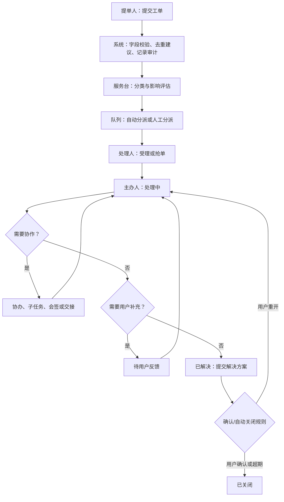

# 工单业务流程设计

## 1. 通用处理流程

所有箭头都是受策略控制的状态转换：权限、必填信息、审批规则、SLA、审计原因和通知模板必须在转换执行时校验。不能用直接修改状态字段绕过流程。

## 2. 责任规则

| 场景 | 责任人变化 | 必填记录 | SLA 处理 |
| --- | --- | --- | --- |
| 自动分派 | 队列成为责任方，尚无个人主办人 | 命中规则、候选队列、时间 | 首响计时继续 |
| 抢单/受理 | 领取人变为主办人 | 原子领取结果、处理组 | 首响完成；解决计时继续 |
| 转派 | 目标队列/人员获得责任 | 转派原因、前后处理人、目标确认 | 是否暂停/重算由服务目录规则决定 |
| 添加协办 | 主办人不变 | 协办任务、目标、期限 | 主单继续；协办可有子 SLA |
| 并行子任务 | 主办人不变 | 子任务输入、汇聚规则 | 以主单 SLA 为主，子任务风险预警 |
| 交接班 | 接班人变为主办人 | 交接摘要、未完事项、接班确认 | 连续计时，不因交接重置 |
| 挂起 | 主办人保留 | 挂起原因、恢复时间/事件 | 仅允许符合目录规则的原因暂停 SLA |
| 升级 | 主办人保留，增加升级责任方 | 级别、原因、通知和决策 | 触发升级计时与主管可见性 |

## 3. 多人处理状态模型

### 3.1 主办与协办

- 每张主工单任意时刻只能有一名主办人，主办人负责对外回复、状态迁移和关闭质量。
- 协办人针对可验收的协作事项提交结论；主办人可采纳、退回或继续补充。协办完成不等同于主单解决。
- 主办人离岗或权限失效时，队列主管应在设定时限内转派；系统告警但不擅自将责任交给任一候选人。

### 3.2 并行与会签

- **并行处理**适用于网络、应用、数据库等同时排查。流程汇聚之前不允许把主单标为已解决，除非配置为“任一分支满足即可”。
- **会签**用于关闭高影响事故、权限敏感服务或需要多专业确认的事项。会签成员在任务创建时固化，支持全部通过、比例通过和任一否决；否决必须附原因并进入返工路径。
- **或签**适用于值班组/角色池，第一名领取并完成者使其余候选任务失效；避免多人重复审批。

### 3.3 评论与可见性

公开回复面向提单人和订阅者，内部评论仅对处理组、协办人、审批人和具有数据范围权限的主管可见。附件沿用评论或工单的最高保密级别；下载应二次鉴权并记录审计。

## 4. 页面卡顿专项流程

专项字段应支持“未知/未采集”，不应阻断用户提交。处理人通过报告链接、Trace ID、日志检索条件定位证据；工单仅保存必要摘要和链接。涉及用户标识、IP、Cookie、URL 参数或业务数据时，应按数据分级脱敏后展示和导出。

## 5. 异常与回退规则

| 异常 | 系统规则 |
| --- | --- |
| 误分类/误分派 | 保留历史分类和责任链；重新分类后按规则重新路由，不能覆盖旧记录 |
| 用户长期未回复 | 待反馈超期自动提醒；自动关闭前按目录配置保留期，关闭后允许有限期限内重开 |
| 处理人无响应 | 触发队列提醒、主管升级或自动回收到队列；不删除已产生的处理记录 |
| 外部平台不可用 | 工单核心流程继续；集成事件进入重试/人工补偿队列，并向处理人展示降级状态 |
| 流程配置发布错误 | 新实例停止进入该版本；运行中实例按已发布版本继续，管理员用受审计的迁移方案处理 |

## 6. 流程治理

每一个服务目录流程都需要流程负责人、BPMN 定义、表单版本、审批策略、SLA 规则、权限范围、异常分支和测试用例。流程发布采用草稿、评审、发布、废弃四态，生产中禁止直接编辑已发布版本。

当前平台提供仅限平台管理员读取的 Flowable 定义登记视图，用于核验正在运行的流程键、引擎版本和部署时间；该视图不是低代码发布入口。BPMN/DMN 文件、表单/策略版本和数据库迁移必须由受控制品一起评审、签名、发布和回滚，运行中实例继续引用其已启动的引擎定义，不会被“发布最新版”直接改写。

### 6.1 受控跳转与流程迁移

允许使用可视化流程图选择目标节点，但“可视化”不等于任何人可任意跳转。跳转操作仅面向流程负责人、具备数据范围的平台管理员和应急授权人员；按目录和风险级别要求单人或双人审批。系统在沙箱中预演目标节点、将撤销或保留的任务、重新生成的候选人、SLA/OLA 影响、通知和关联审批，再由后端一次性执行。

跳转只能发生在已发布 BPMN 中声明的可达纠偏节点，不能跳过硬性审批/会签、身份授权、风险确认或结束节点。执行时需取消或完成原任务的处置记录，重新计算目标节点权限与候选人，保持主单 SLA 连续计时；所有历史任务、原分支、原因和审批均保留。流程版本迁移采用同样的受控机制，运行中实例不可被前端或数据库直接修改。

## 7. 重大事件与关联对象

P1 不使用普通工单的线性升级替代。达到服务目录 P1 阈值后，系统在主工单上创建重大事件上下文，固化事件指挥官、技术主责、业务沟通人、记录员、影响范围和通报节奏；恢复后才进入关闭确认与 PIR。事件可关联多个告警、CI、问题单和紧急变更，但各对象保持自己的状态与审批规则。

服务请求、权限申请、事件、问题和变更采用不同的服务目录与表单。普通请求可以按服务目录串行审批；权限申请必须使用授权人和有效期规则；事件以恢复服务为目标；问题负责根因与已知错误；变更负责实施窗口、风险、回退和审批。它们通过关联关系协同，而非把所有动作塞进一个状态机。

### 7.1 关联工单控制流程

关联由已授权用户在源工单中发起，填写目标工单完整编号并选择受控类型：普通关联、重复于、父工单、关联问题或关联变更。服务端先确认源单可修改，再确认目标单对当前用户可读；任一条件不成立即拒绝，页面和错误响应均不得返回目标单摘要。普通关联以稳定编号顺序规范化并按自然键去重，避免正反两次操作生成重复边；其他方向性关系保留发起方向。关系只表达协同和追踪，不会自动合并、关闭、转派、继承审批或改变 SLA；如需转换/合并，必须走后续独立的受控流程。每次成功建立均记录主体、两端编号、类型、时间和请求关联 ID。

## 8. 当前工作流实现约束

当前实现使用 Flowable BPMN 生命周期和平台侧工作流投影共同驱动状态。工单详情先读取授权后的工作流概览，服务端据当前 IAM 身份、主办/协办关系、任务候选资格及工单状态返回可用动作；浏览器只显示该结果。

动作提交时服务端仍会重新执行对象授权、流程状态迁移、目标 IAM 用户启用状态、目标活动支持角色和工单版本比对。`CLAIM` 为原子抢单；`ASSIGN`、`TRANSFER`、`ADD_COHANDLER`、`HANDOVER` 仅提交候选 IAM ID，候选人必须来自只读 IAM 角色投影，不能由浏览器指定或伪造角色、组织、流程节点或最终数据范围。受控跳转始终是独立申请/审批能力：工单详情仅对服务经理或平台管理员返回每个已批准申请的服务端计算管理能力；普通用户、处理人和只读人员既看不到预演/执行入口，也不能通过直接调用接口绕过授权。

当前详情页的“协作人员”来自工作流参与人快照：抢单、分派、转办、协办写入时均从 IAM 只读投影中提取姓名、组织和主岗；后续 IAM 调岗不会回写这些记录。当前仅显示仍有效的主办/协办，历史主办变动通过流程事件和审计记录追溯。

受控跳转申请现作为独立审批申请记录返回工单详情，字段包括申请人、源/目标节点、理由、状态和申请时间。该读模型只展示真实的 `PENDING_APPROVAL` 等状态；在审批决策和受控执行服务落地前，系统不会把流程事件、评论或普通动作伪装为审批结论。

审批决策必须由独立 Flowable 审批流程承载，而不是依赖业务表状态机：受控跳转申请创建前，服务端先解析一个已发布的具体 BPMN 定义 ID 和版本，并冻结候选审批角色、**具体 IAM 审批人**、决策模式、超时/升级策略版本与捕获时间；申请人从候选集合剔除。随后只能按该定义 ID 启动实例，避免“取到版本 A、启动时变成版本 B”。后续发布、角色映射或策略变更不改写该快照。当前 `servicehubControlledJumpApproval` 以并行多实例用户任务处理冻结人员：部署受控策略解析为 `ANY_ONE` 时任一审批通过/拒绝即结束并撤销其他任务；解析为 `ALL_OF` 时全体通过才结束，任一拒绝立即结束。模式只能由服务端部署配置 `SERVICEHUB_CONTROLLED_JUMP_ALL_OF_TARGET_NODES` 按目标节点解析，浏览器、URL、请求体和管理页面均不能选择。每次完成先追加不可变决策记录，只有 Flowable 实例结束时才把申请投影落为 `APPROVED` 或 `REJECTED`。未保存具体定义 ID 或冻结人员集合的历史记录仅可审计展示，禁止继续审批。审批通过仅表示获得后续受控执行资格，不会直接修改 BPMN 节点、工单状态、SLA 或处理人；执行前仍需进行目标节点白名单、实例版本、未完成任务、候选人和影响预演校验。平台现提供只读预演接口，核验审批结论、申请时固化的工单/流程版本、当前源节点、目标白名单和目标差异；任一项变化即返回阻断原因，且预演不调用 Flowable 状态迁移、不更新工单、不发送通知。预演只返回目标候选角色及候选人重算策略：提单人节点重新验证身份快照，处理节点在执行时按当前 IAM 角色池和值班数据范围重算；预演不返回或冻结具体处理人。

审批待办只能从 Flowable 的活动**已指派任务**读取，并以审批申请 ID 关联平台投影后逐条复核工单对象权限；不能因为业务表中仍有 `PENDING_APPROVAL` 记录就将其展示为可处理任务。只有冻结 IAM 审批人且持有服务经理/平台管理员角色才能看到自己的任务；申请人不生成审批任务，提交接口也会再次拒绝自审。待办响应不返回总数量，以免借由数量、分页或空页枚举无权工单。

每个引擎审批任务完成后，平台额外追加不可变的审批决策记录，包含审批申请、Flowable 任务 ID、审批人、结论、理由与时间；它不是审批状态机，也不替代 Flowable 的活动任务。多实例会签/或签按每个实例任务追加记录，最终状态完全以 Flowable 进程是否结束及其结论为准；冻结集合以 IAM 用户 ID 去重，因而一个用户不能完成另一个人的实例任务。比例通过、加签、代理、超时/升级仍属于后续受控 BPMN/DMN 版本，未实现前不得以业务表或前端逻辑替代。

当预演通过且具备服务经理/平台管理员对象权限时，受控执行服务先将申请从 `APPROVED` 原子保留为 `EXECUTING`，因此相同申请无法并发或重复执行；随后一次性迁移 Flowable 活动、取消源任务投影、创建目标任务、更新工单/流程版本、重算 SLA 和通知收件人，并落为 `EXECUTED`。执行记录保存执行人、开始/完成时间和源/目标节点；详情页将“审批通过”和“已执行”分别展示。详情页的管理弹窗必须先调用只读预演，再允许二次确认执行；其返回的展示能力不能替代写接口的再次授权、审批、版本和节点检查。任一编排步骤失败时事务整体回滚，开发内存实现也会显式释放执行保留；页面收到 `503 SERVICE_UNAVAILABLE` 的安全可重试摘要，完整诊断保留在审计与运维日志中。执行入口仍是后端受控接口，普通用户和仅能查看详情的人员没有页面按钮或绕过路径。

### 8.1 本地多身份回归边界

为验证提单、处理、审批三个主体的服务端授权边界，本地 `mysql,local-dev` 配置可在回环地址上通过固定身份选择器运行 `requester`、`first-line`、`service-manager` 和 `admin` 四个夹具。选择器只映射到代码中固定的 IAM 用户与角色，未知值不降级为管理员并由安全链拒绝；每个主体独立获取 CSRF 会话。该能力不传输 IAM 用户 ID、角色、组织范围或密码，且生产 profile 不加载此过滤器，真实环境必须由 IAM/SSO 提供认证与授权上下文。
