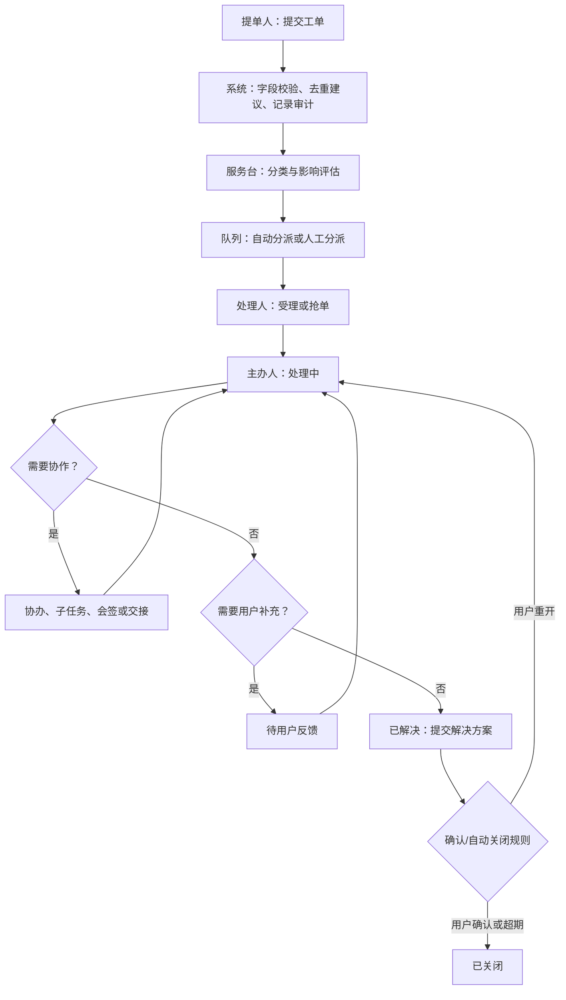

# 工单业务流程设计

## 1. 通用处理流程

所有箭头都是受策略控制的状态转换：权限、必填信息、审批规则、SLA、审计原因和通知模板必须在转换执行时校验。不能用直接修改状态字段绕过流程。

## 2. 责任规则

| 场景 | 责任人变化 | 必填记录 | SLA 处理 |
| --- | --- | --- | --- |
| 自动分派 | 队列成为责任方，尚无个人主办人 | 命中规则、候选队列、时间 | 首响计时继续 |
| 抢单/受理 | 领取人变为主办人 | 原子领取结果、处理组 | 首响完成；解决计时继续 |
| 转派 | 目标队列/人员获得责任 | 转派原因、前后处理人、目标确认 | 是否暂停/重算由服务目录规则决定 |
| 添加协办 | 主办人不变 | 协办任务、目标、期限 | 主单继续；协办可有子 SLA |
| 并行子任务 | 主办人不变 | 子任务输入、汇聚规则 | 以主单 SLA 为主，子任务风险预警 |
| 交接班 | 接班人变为主办人 | 交接摘要、未完事项、接班确认 | 连续计时，不因交接重置 |
| 挂起 | 主办人保留 | 挂起原因、恢复时间/事件 | 仅允许符合目录规则的原因暂停 SLA |
| 升级 | 主办人保留，增加升级责任方 | 级别、原因、通知和决策 | 触发升级计时与主管可见性 |

## 3. 多人处理状态模型

### 3.1 主办与协办

- 每张主工单任意时刻只能有一名主办人，主办人负责对外回复、状态迁移和关闭质量。
- 协办人针对可验收的协作事项提交结论；主办人可采纳、退回或继续补充。协办完成不等同于主单解决。
- 主办人离岗或权限失效时，队列主管应在设定时限内转派；系统告警但不擅自将责任交给任一候选人。

### 3.2 并行与会签

- **并行处理**适用于网络、应用、数据库等同时排查。流程汇聚之前不允许把主单标为已解决，除非配置为“任一分支满足即可”。
- **会签**用于关闭高影响事故、权限敏感服务或需要多专业确认的事项。会签成员在任务创建时固化，支持全部通过、比例通过和任一否决；否决必须附原因并进入返工路径。
- **或签**适用于值班组/角色池，第一名领取并完成者使其余候选任务失效；避免多人重复审批。

### 3.3 评论与可见性

公开回复面向提单人和订阅者，内部评论仅对处理组、协办人、审批人和具有数据范围权限的主管可见。附件沿用评论或工单的最高保密级别；下载应二次鉴权并记录审计。

## 4. 页面卡顿专项流程

专项字段应支持“未知/未采集”，不应阻断用户提交。处理人通过报告链接、Trace ID、日志检索条件定位证据；工单仅保存必要摘要和链接。涉及用户标识、IP、Cookie、URL 参数或业务数据时，应按数据分级脱敏后展示和导出。

## 5. 异常与回退规则

| 异常 | 系统规则 |
| --- | --- |
| 误分类/误分派 | 保留历史分类和责任链；重新分类后按规则重新路由，不能覆盖旧记录 |
| 用户长期未回复 | 待反馈超期自动提醒；自动关闭前按目录配置保留期，关闭后允许有限期限内重开 |
| 处理人无响应 | 触发队列提醒、主管升级或自动回收到队列；不删除已产生的处理记录 |
| 外部平台不可用 | 工单核心流程继续；集成事件进入重试/人工补偿队列，并向处理人展示降级状态 |
| 流程配置发布错误 | 新实例停止进入该版本；运行中实例按已发布版本继续，管理员用受审计的迁移方案处理 |

## 6. 流程治理

每一个服务目录流程都需要流程负责人、BPMN 定义、表单版本、审批策略、SLA 规则、权限范围、异常分支和测试用例。流程发布采用草稿、评审、发布、废弃四态，生产中禁止直接编辑已发布版本。

### 6.1 受控跳转与流程迁移

允许使用可视化流程图选择目标节点，但“可视化”不等于任何人可任意跳转。跳转操作仅面向流程负责人、具备数据范围的平台管理员和应急授权人员；按目录和风险级别要求单人或双人审批。系统在沙箱中预演目标节点、将撤销或保留的任务、重新生成的候选人、SLA/OLA 影响、通知和关联审批，再由后端一次性执行。

跳转只能发生在已发布 BPMN 中声明的可达纠偏节点，不能跳过硬性审批/会签、身份授权、风险确认或结束节点。执行时需取消或完成原任务的处置记录，重新计算目标节点权限与候选人，保持主单 SLA 连续计时；所有历史任务、原分支、原因和审批均保留。流程版本迁移采用同样的受控机制，运行中实例不可被前端或数据库直接修改。

## 7. 重大事件与关联对象

P1 不使用普通工单的线性升级替代。达到服务目录 P1 阈值后，系统在主工单上创建重大事件上下文，固化事件指挥官、技术主责、业务沟通人、记录员、影响范围和通报节奏；恢复后才进入关闭确认与 PIR。事件可关联多个告警、CI、问题单和紧急变更，但各对象保持自己的状态与审批规则。

服务请求、权限申请、事件、问题和变更采用不同的服务目录与表单。普通请求可以按服务目录串行审批；权限申请必须使用授权人和有效期规则；事件以恢复服务为目标；问题负责根因与已知错误；变更负责实施窗口、风险、回退和审批。它们通过关联关系协同，而非把所有动作塞进一个状态机。
