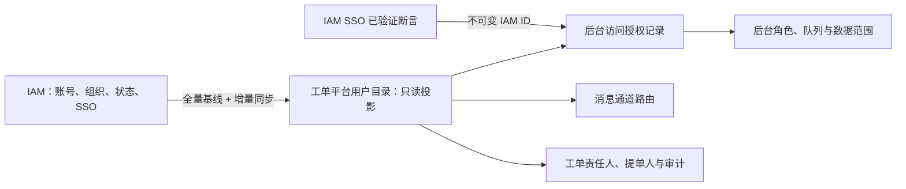
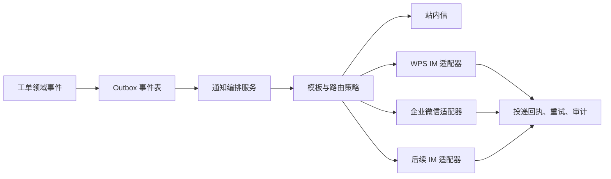

# 身份与消息通道设计

## 1. 结论

IAM 是身份、账号状态和组织机构的唯一权威源。工单系统不保存密码、不提供本地账号注册或组织编辑，也不将 IAM 用户复制为可独立维护的“本地用户”。所有经 IAM 登录且处于启用状态的人员，默认仅以普通提单人身份使用前台服务。

但系统必须保存一份**只读用户与组织投影**，即使启用 IAM 单点登录也不能省略。它用于授权计算、待办分派、主协办关系、组织数据范围、审批候选人、消息路由、审计和历史查询。

## 2. 身份模型

### 2.1 本地应保存的数据

| 数据 | 用途 | 维护方式 |
| --- | --- | --- |
| `iam_identity_id` | 不可变身份主键 | IAM 同步，不可人工修改 |
| 登录名、姓名、状态 | 展示、登录绑定、待办可用性 | IAM 同步 |
| 组织编码、组织路径、岗位、主管标识 | 数据范围、队列、审批候选人 | IAM 同步 |
| 后台访问授权 | IAM ID 是否可进入后台、后台启停状态、授权版本 | 平台后台管理员受控维护；不回写 IAM |
| 平台角色与数据范围 | 服务台、二线组、审批候选人、处理人资格和对象范围 | 仅由已授权后台人员配置；版本化、最小权限、审计 |
| WPS IM / 企业微信成员标识 | 消息路由 | IAM 扩展字段或通道适配器解析 |
| 同步版本、来源时间、同步状态 | 追踪与故障补偿 | 系统维护 |

系统不保存 IAM 密码、访问令牌、可逆身份证明或用户可编辑的组织关系。

### 2.2 工单中的身份快照

工单保存 `requester_identity_id`、`assignee_identity_id` 等外键，同时在创建/转派/审批时记录姓名、组织名称、岗位、来源和时间的不可变快照。人员调岗、改名或离职后，历史工单仍能准确展示当时责任归属；当前权限则实时依据最新用户目录计算。

### 2.3 用户管理界面边界

平台提供“内部用户目录”，用于搜索、查看同步状态、所属组织、服务角色、可处理队列和消息可达性。目录本身只读，不提供新建、删除、改密码或修改组织功能。另设独立的“后台人员授权”页面：管理员只能从已同步的启用 IAM 用户中选择 IAM ID，配置后台启停、平台角色和数据范围；不能编辑姓名、组织、密码或 IAM 账号状态。

后台授权必须满足以下边界：

- IAM ID 仅是已验证 SSO 主体的绑定键，不是可填写的登录凭据；登录成功后由服务端使用断言中的不可变 ID 查询授权记录。
- `REQUESTER` 为所有启用 IAM 用户的隐含基础角色，不能被后台撤销或单独授予；一线、二线、审批、服务经理、SLA 管理、审计和平台管理员等仅可授予后台人员。
- 授权变更必须记录操作者、目标 IAM ID、变更前后角色与数据范围、原因、时间和版本；禁止管理员修改自身权限，禁止移除最后一名平台管理员。平台管理员等高危角色应纳入双人复核策略。
- 人员在 IAM 停用、后台授权停用或角色撤销后立即失去新增处理、审批和管理能力；已登录会话在下一次服务端授权校验时收敛，历史工单与审计不删除。

### 2.4 `DATA_SCOPE` 解析基线

后台角色只回答“能否执行某类动作”，数据范围回答“能对哪些对象执行”，两者必须同时满足。服务端以受控的范围类型和对象主键解析授权，一期至少包括：

| 范围类型 | 标准权限形式 | 匹配对象 |
| --- | --- | --- |
| 组织 | `DATA_SCOPE_ORGANIZATION:<iamOrganizationId>` | 工单当前申请组织、服务归属组织或经批准的组织树范围 |
| 服务系统 | `DATA_SCOPE_SERVICE_SYSTEM:<systemCode>` | 服务端已固化到工单的受影响系统，不采信请求体中的系统编码 |
| 服务目录 | `DATA_SCOPE_SERVICE_CATALOG:<catalogItemId>` | 工单创建时固化的已发布目录项及其版本 |
| 处理队列 | `DATA_SCOPE_QUEUE:<queueCode>` | 流程当前服务端责任队列或已审计的历史队列 |

权限编码不得一词多义；历史 `DATA_SCOPE_SERVICE` 不得同时表示“服务系统”与“服务目录”，必须经受控迁移后使用上述明确类型。同一类型内的多个值取并集，一个授权包内不同类型取交集；多个独立授权包之间可取并集，但不得将不同授权包的组织、系统、目录和队列拆开后做笛卡尔积扩权。组织含下级必须是授权记录中明确的受控选项，并以 IAM 当前组织树闭包计算，禁止用名称前缀或客户端路径猜测上下级。

每次详情、列表、计数、搜索、导出、附件和流程动作都必须按以下顺序重新计算：当前 IAM 主体启用 → 后台授权启用 → 当前角色允许动作 → 当前授权包覆盖服务端对象属性 → 当前对象关系和流程状态允许。`ROLE_PLATFORM_ADMIN` 只代表平台配置管理能力，`ROLE_AUDITOR` 只代表只读审计能力，二者均不自动获得全集团工单、附件或业务配置数据权。全局或跨组织权限必须是独立、可追溯、限时且经复核的授权，不允许隐式通配符。

### 2.5 调岗、停用与授权立即收敛

IAM 停用、离职、主组织/岗位调整，或平台后台授权停用、角色/范围撤销，均必须使权限在下一次服务端请求时立即生效；不得依赖登录时角色、前端菜单、本地会话权限集或过期候选人缓存。后端可缓存投影，但必须用 IAM 同步版本与后台授权版本绑定，变更事件须主动失效相关会话授权、对象授权和路由候选集缓存。

停用或失去范围的人员不得继续读取工单、下载附件、处理待办、导出数据、成为新候选人或接收新业务通知。其已在办工单、待办、值班和审批必须进入可观测的“授权失效待重分派”状态，由具有同一服务范围的队列主管按流程处置，禁止静默保留原权限或直接交给无范围的平台管理员。历史身份快照仅供追溯，不能作为当前授权依据。

### 2.6 团队成员、队列与审批候选版本

队列成员资格不得仅由角色推导。平台必须保存受控的团队/队列成员关系，至少包含队列编码、IAM ID、职责类型、有效期、启用状态、成员版本、队列授权版本（队列服务范围/成员政策版本）、当前后台授权版本和变更审计。一个可处理/可审批的候选资格必须同时命中：当前 IAM 启用及投影版本、当前后台角色/范围授权版本、当前队列成员版本和队列授权版本、已发布路由/审批政策版本与目标工单的服务端对象范围。

IAM 停用、离职或调岗，后台撤权，队列退组/成员到期，或路由政策更新时，必须在同一收敛链路更新或失效成员版本、候选缓存、待办投影和消息收件人缓存。已冻结候选快照不被改写，但快照中已失效的人员不得继续看见、签收或完成任务；任务进入待重算/待重分派并告警。

审批候选必须实行三阶段范围复核：

1. **创建阶段：** 以服务端目标工单快照与已发布政策计算候选人，只冻结同时命中角色、完整 `DATA_SCOPE` 授权包、队列成员关系和职责分离的人员。申请人、拟受让/拟获益的目标人、已被政策禁止的关联人必须在服务端排除，不得由客户端提交排除名单。
2. **展示/领取阶段：** 只向本人返回其当前仍可决策的待办，或在已授权目标工单/任务上下文返回最小化、有界的候选结果。不返回全队列名册、冻结候选总数、被排除人员或无权人员是否存在。
3. **决策/完成阶段：** 同时验证决策人属于不可变候选快照，且当前 IAM、后台授权、`DATA_SCOPE`、队列成员和职责分离仍有效。任一当前条件失效即拒绝决策，不得以冻结快照、任务 ID 或历史角色 fail-open。

三阶段均须记录相同关联 ID，以及候选政策版本、IAM 投影版本、后台授权版本、队列成员版本、队列授权版本、范围摘要、排除原因码与允许/拒绝结果；审计不记录无权候选人名单。

### 2.7 知识组织/目录归属与历史迁移

每个知识文档必须有服务端受控的归属组织 `owningOrganizationId` 和服务目录 `serviceCatalogItemId`；文档版本、导入任务、审核意见、预览制品和反馈均继承并固化该归属。归属只能从已发布目录、服务端工单快照或经审批的管理命令中得到，禁止用请求人当前组织、创建人、标签、文件路径或前端筛选临时替代。归属变更必须新建待审核版本并重新发布，不回写历史版本。

知识列表/搜索、详情、草稿、版本、导入队列、审核、发布/归档、预览/下载和反馈必须使用同一份“当前角色 + `DATA_SCOPE_ORGANIZATION` + `DATA_SCOPE_SERVICE_CATALOG` + 发布/扫描状态”授权谓词。普通人员仅可读取当前范围内已发布版本并对其反馈；草稿、导入任务、版本列表与审核意见只向同范围知识管理/审核角色开放。申请人不得审核、发布或完成自己提交的归属变更。

旧数据中任一组织/目录归属为空、不存在、未发布或无法唯一判定的知识，对所有普通读取、草稿查询、审核、预览、反馈和发布均 fail-closed，只能进入独立迁移待办。迁移须使用受控脚本/管理任务，以干运行生成候选映射，经业务责任人与安全/数据责任人复核后分批提交。每批固化原对象 ID、原字段摘要、目标组织/目录、规则/脚本版本、申请人、审批人、影响行数、失败行摘要、开始/完成时间和回退批次，并写入不可篡改审计；禁止默认归到全局、创建人组织或首个目录。

### 2.8 幂等身份绑定与队列迁移执行身份

幂等键只是重试关联标识，不是授权凭据。服务端幂等记录必须绑定当前已验证 IAM 主体、受控操作编码、资源类型/资源 ID（创建前使用明确的 `NEW`/业务命名空间）和规范化请求指纹。规范化内容包括影响业务结果的动作、目标、版本/前置条件和允许字段，并对 Unicode、时间、枚举、集合顺序、空值和默认值做稳定化；不将 Cookie、令牌、CSRF、追踪头、上传临时路径或其他传输噪声纳入。

同一绑定与相同指纹的重试只返回首次结果或安全结果引用；同一主体/键被复用到不同操作、资源或指纹时返回稳定冲突，不执行业务。另一主体提交相同键时绝不得取得、推测或覆盖原主体结果；按发布策略在主体命名空间独立处理或统一返回不泄露存在性的冲突。幂等检查与业务、审计/outbox 须在同一事务或可验证的原子边界内完成。

幂等记录只保存键摘要、绑定字段、规范化指纹、结果引用/状态、创建/到期时间和必要原因码，不保存请求原文、密码/令牌/Cookie、评论正文、附件内容/文件名、恶意样本或外部系统原始回执。请求指纹使用不可逆摘要，但不得将低熕敏感值直接单独哈希后留存。

`IN_PROGRESS` 幂等记录必须带服务端生成的租约所有者、租约到期时间、尝试次数和指纹密钥版本。租约未到期时任何其他节点只能返回稳定“处理中/冲突”，不得并发执行。租约到期后只能用版本/CAS 原子接管；接管前先按主体、操作、资源、指纹与结果引用对账业务、审计/outbox。若业务已成功，只补齐幂等成功状态并重放安全结果；只有能证明未产生副作用时才允许重新执行。结果不确定时进入 `RECONCILIATION_REQUIRED`/`FAILED_FINAL` 并告警，禁止猜测重试。

节点崩溃恢复至少覆盖“预留后、业务前”、“业务已提交、幂等未完成”、“幂等已完成、响应未返回”和“两节点同时尝试接管”。所有路径必须证明有效一次业务结果、有效一次审计/outbox，且不返回他主体结果。

指纹 HMAC 密钥每个环境独立，至少 32 个随机字节，只由受管密钥系统/部署 secret 注入，应用配置只持有当前 `keyVersion` 和可解析引用。每条幂等记录固化 `keyVersion`；新记录只用当前版本签发，轮换窗口可用前一版本校验未到期旧记录，但不得用旧版本新签发。轮换顺序为“预发布验证能力 → 切换新签发 → 等待旧租约/保留期清窗 → 撤销旧密钥”。密钥值、可定位密钥的完整引用、HMAC 中间材料不得出现在日志、审计、指标标签、错误响应、数据库业务字段或管理页面。

### 2.9 V42 历史幂等记录分类与人工对账

V42 时代的无 `keyVersion`/无租约记录不得在升级时伪造为当前 HMAC 版本，也不得用原 SHA-256 指纹冒充 HMAC。升级作业必须按原状态、结果引用、业务/审计/outbox 证据分类：可证明已成功的仅保留为不可重签的历史成功证据；旧 `IN_PROGRESS` 和结果不确定记录进入 `RECONCILIATION_REQUIRED`；可证明未执行的记录按批准策略最终失败后由原主体使用新键重申请。

人工对账必须是受控职责，逐条固化原记录标识、主体/操作/资源摘要、原状态、业务/审计/outbox 证据、判定结果、处理人/复核人、批次和时间。不恢复原始请求，不计算或回填一个看似当前的 `keyVersion`。若 schema 需要非空版本，只能使用明确的非签发分类标识（如 `LEGACY_UNVERIFIED`），且该标识不得出现在 HMAC key ring、新签发或自动重放路径。

生产启动前必须由数据库门禁证明 `keyVersion IS NULL` 为零，且不存在缺少 `keyVersion`/租约 owner/到期时间的旧活动 `IN_PROGRESS`。任一计数非零则拒绝启动写流量，先完成分类与对账。幂等状态接口只对原主体返回操作/资源脱敏摘要、状态、尝试次数、租约到期、安全结果引用和原因码；不返回指纹、幂等键绑定细节、租约 owner、密钥版本/引用或对账原始证据。

队列迁移计划的发起人、审批人和执行人为独立职责，至少要求审批人与发起人不同且均具有当前源/目标队列管理范围。计划冻结源队列、目标队列、选择规则/显式任务集、计划版本、队列授权版本、发起理由和幂等绑定。执行时对每个任务重新校验执行人当前权限、源/目标队列当前启用状态与版本、工单当前范围、任务仍属源队列且可迁移、目标队列覆盖该工单且未超容，以及任务/工单乐观锁版本。

每个任务以原子比较更新迁移，并记录计划/批次/任务 ID、源/目标队列及版本、工单/任务事前事后版本、执行人当前授权摘要、结果和原因码。任一任务校验失败时该任务保持原队列且不改流程/主办；系统性权限、队列版本或数据库故障必须停止后续执行并以 `BLOCKED`/`FAILED` 关闭，不得跳过、放宽目标范围或将失败记为成功。

### 2.10 附件扫描服务身份与信任边界

生产环境必须启用真实、受管的恶意文件扫描器；开发用跳过扫描、固定返回通过、空实现或“扫描器可选”配置不得进入生产 profile。应用启动和接入业务流量前必须确认扫描器配置完整、目标位于部署允许列表、网络策略已生效、扫描引擎可用且病毒库在批准的新鲜度窗口内；任一条件不满足即拒绝启动附件入口/工作者并使 readiness 失败，不得降级为直接放行。

ClamAV 只允许通过受控 Unix socket、同 Pod/同主机 sidecar 或固定内网地址访问；目标地址、端口、协议、DNS、代理和超时只能由部署配置确定，不能来自文件名、工单字段、管理员请求或扫描回执。出站网络只放行扫描器地址，禁止扫描器或应用借附件访问互联网、对象存储管理面或其他内网。扫描调用须有连接/写入/读取/总时限、并发与队列上限、单文件/流量上限、最大响应字节/行数，并只接受允许的 ClamAV 终态；超时、断连、截断、畸形/超大响应、未知状态、签名库过期和引擎不可用均归一为 `SCAN_UNAVAILABLE` 并保持隔离。

扫描器使用独立的最小权限服务身份和网络策略，只能读取本次隔离对象或接收受限字节流，不能列举其他附件或修改业务状态。扫描器认证材料与 IAM、对象存储、消息通道及幂等 HMAC 密钥完全分域，不得复用、派生或把扫描器版本/签名库版本伪装成 `keyVersion`；扫描失败也不得触发任何密钥回退。

恶意命中转为 `QUARANTINED`/`REJECTED`，扫描不可用转为 `SCAN_UNAVAILABLE`，二者都不能下载、预览、抽取、导入、发布或投递。接收、扫描开始、规范化结果、隔离、拒绝、重扫申请和最终处置均写追加式审计，记录主体/服务身份、父对象脱敏引用、文件摘要、引擎与签名版本、安全结果码、耗时和关联 ID；不得记录文件原文、恶意载荷、原始 ClamAV 回执、存储路径、网络地址或任何密钥材料。

### 2.11 前端草稿、能力提示与终端隔离

浏览器草稿默认只保存在当前页面内存。首期跨刷新恢复仅允许把系统/目录和明确非敏感的布尔、枚举、日期选项写入当前标签页 `sessionStorage`，并以组织 + IAM 主体 + 表单/目录版本隔离；主题、自由正文、自定义标签、密码、令牌、Cookie、CSRF、完整联系方式、内部评论、附件内容/名称/路径/File Handle、导出结果、扫描回执或高密级正文永不持久化。未来如扩大范围或改为跨设备恢复，必须改用“部署/租户 + 服务端签发主体命名空间 + 表单版本 + 临时资源 ID”的服务端草稿仓库；浏览器端加密不能作为放宽理由。

标签页草稿固化 `createdAt`、`updatedAt`、组织/IAM 主体、版本和不超过 24 小时的 TTL；未来服务端草稿的绝对到期时间不得由客户端活动、本机时间或篡改字段延长。到期、成功提交、显式放弃、登出、会话失效、IAM 主体切换、组织/范围或表单版本不再兼容时立即清理；身份刷新失败必须同时清空旧主体、capability 和当前标签页缓存。身份消失或主体变化时须重建页面执行上下文，由浏览器终止旧文档的目录、字典、匹配、预览和提交请求，禁止旧主体响应写回新主体页面。恢复瞬间重新确认当前主体、组织、版本和字段可见性，只恢复仍有权且仍存在的安全结构化选项，绝不自动恢复正文、附件或重放提交。

后端返回的 capability/allowedActions 只用于隐藏、禁用和解释界面动作，是特定主体、资源与授权版本下的短期展示提示，不是授权凭据。前端不得根据角色名自行扩展 capability，也不得把 capability、路由守卫、隐藏按钮、CSS 或客户端状态当作对象授权；修改浏览器状态、直接调用 API、重放旧 capability 或让按钮重新出现，都必须由后端在每次请求重新鉴权并安全拒绝。capability 获取失败、过期或主体/对象不匹配时界面默认不展示敏感动作，但不能据此宣称对象不存在或状态稳定。

表单只展示当前主体有权使用的已发布字段，服务端错误在前端按稳定公开错误码映射。字段错误仅能关联本次提交且当前可见的字段；授权失败、对象不存在、隐藏字段、其他组织目录/人员和后端异常统一使用防枚举提示，不渲染原始响应、堆栈、SQL/类名、存储路径、策略表达式、无权字段名/值或他主体数据。可显示脱敏请求 ID 供支持定位，但不得把原始输入、草稿正文或凭据拼入 URL、埋点、通知或错误日志。

## 3. 全量同步与 SSO

1. 首次导入 50,000 用户和全量组织，后续采用增量同步并定期全量校验。
2. SSO 启用后，OIDC/SAML 断言中的不可变 ID 必须与 `iam_identity_id` 绑定，禁止仅按姓名或登录名匹配；忽略断言中的业务角色声明，后台角色和数据范围仅以平台受控授权记录解析。
3. 用户停用、后台授权停用或其处理角色失效时立即禁止登录后台、抢单、被分派和新审批任务；历史记录不删除。进行中的责任工单交由队列主管按流程转派。
4. IAM 暂时不可用时，已登录会话是否允许短时续用由安全策略决定；禁止绕过 IAM 创建本地账号。

## 4. 消息通道架构

消息通道是可插拔适配器，不让工单领域代码直接依赖 WPS IM、企业微信或其他厂商 API。

### 4.1 统一通道契约

每个适配器只实现统一的 `send(NotificationRequest)`、`queryDelivery()` 和可选的 `resolveRecipient()` 契约。请求至少包括事件 ID、业务编号、接收人 IAM ID、通道成员 ID、模板编码、优先级、脱敏变量和幂等键。

支持的事件包括：建单、分派/抢单、转派、协办、评论、审批待办、SLA 预警/升级、解决、关闭、重开和集成失败。P1 升级、审批待办等关键通知应强制站内信加至少一个外部通道；普通提醒可由用户订阅偏好控制。

### 4.2 安全与可靠性

- WPS IM、企业微信等通道凭证加密存储，按环境隔离并支持轮换；不出现在工单正文、日志或前端页面。
- 外部回调必须验证签名、时间戳和来源；所有投递以事件 ID 幂等，采用指数退避、限流和死信队列。
- 通道不可用时不影响工单状态迁移，事件进入补偿队列，并以站内信或运维告警兜底。
- 模板变量按权限和数据分级脱敏，默认不发送附件正文、访问令牌、完整 IP、URL 敏感参数或业务敏感数据。
- 记录待发送、已发送、已送达、失败、重试和人工补偿等全链路审计。

### 4.3 接入顺序与 POC

一期：站内信与 WPS IM；二期：企业微信；后续以同一适配器协议扩展其他 IM。WPS IM 和企业微信上线前需确认其机器人/应用接口、身份映射字段、群聊能力、回执能力、单接口限额、网络白名单和签名机制，并以测试租户完成端到端投递 POC。

### 6.1 投递可靠性与 WPS 受管边界

通知创建时始终先落站内信及其 `IN_APP` 投递记录；命中 WPS IM 已发布路由时，再在同一业务事务创建独立的 `PENDING` 外部投递和 Outbox 事件。后台投递器以短事务认领到期事件、在服务端调用固定适配器，并用投递租约防止实例故障后永久卡在处理中。可重试故障按受控指数退避回写 `RETRY_SCHEDULED`，达到次数或不可重试故障后落为 `FAILED_FINAL`；任何外部投递失败均不得影响工单状态或抹去站内信兜底。

WPS 适配器只接收部署环境注入的受管应用标识、固定 HTTPS/内网端点、密钥引用、模板引用和平台跳转基址。浏览器、组织路由、工单字段和管理员页面均不能提交 URL、请求头、密钥、模板正文或外部收件人。未配置受管凭据或端点时，适配器只返回稳定的安全失败码，绝不把“未实际发送”写成已送达。组织到通道的解析只使用收件人的可信 IAM 当前组织及已发布规则，支持向上匹配下级组织规则，并在投递快照中保留规则事实供审计。

## 5. 当前实现映射

- 本地平台已保存 IAM 用户、组织、岗位的只读投影；本地开发初始化数据仅为虚构夹具，不能替代 IAM 同步。
- 已新增平台受控的“后台人员授权 + 角色 + 数据范围”记录（`platform_backoffice_user`、`platform_backoffice_user_role`、`platform_backoffice_user_data_scope`），替代开发期 `iam_user_role_projection` 作为处理人与审批候选人的角色依据。IAM 同步表只保存身份和组织；分派、转办、协办与交接的候选人必须同时是活动 IAM 用户、已启用后台人员且拥有活动支持角色。浏览器只提交候选 IAM ID，不能携带或伪造角色。
- 后台人员授权接口为 `GET/PUT /api/v1/admin/backoffice-access/{iamUserId}`：仅平台管理员可调用，读取和写入均校验 IAM 用户启用状态；更新使用乐观锁、禁止修改自身、禁止移除最后一名平台管理员，并产生审计事件。接口与页面不接受 IAM 密码、令牌、姓名或组织写入字段。
- 已提供可选 OIDC 登录接入：仅在部署配置 `SERVICEHUB_IAM_SSO_ENABLED=true` 且提供标准 Spring OAuth2 Client 注册信息后启用。成功回调只读取受配置保护的不可变主体字段（默认 `sub`），将其置换为服务端 `VerifiedIamAuthentication` 会话；每次领域操作重新解析 IAM 启用状态、本地后台角色与数据范围，不采信 ID Token/UserInfo 中的业务角色声明。SAML 适配器须复用同一受验证主体工厂。
- MySQL 生产部署使用追加式 `audit_event` 表持久化审计证据（操作、主体、请求 ID、资源、时间和非敏感属性）；应用账户不得拥有该表的更新/删除权限。审计持久化失败会向调用方抛错；已在事务中的工单创建、工作流动作、公告和 SLA 管理会随事务失败，避免出现“已变更但无审计证据”。本地开发使用日志审计替代，不能作为生产留存证明。
- 工单创建、分派和处理历史保留 IAM ID 与身份快照；详情页展示提交时快照而不以当前调岗信息覆盖历史。
- “我的待阅”从当前 IAM 用户的未读站内通知反查关联工单；它不代表处理权限，打开工单时仍需执行对象授权。
- 通知表、投递表和 Outbox 已作为持久化边界存在；WPS IM 通道配置默认禁用，未录入任何真实凭据或生产通道地址。
- 关联工单不以 IAM 组织字段作浏览器侧过滤依据：创建时当前身份须同时拥有源单修改权和目标单读取权；读取关联列表时仍逐条确认目标当前可见性。这样既能支持跨部门协同，也避免通过工单编号或历史关联反向枚举人员、组织或工单数据。
