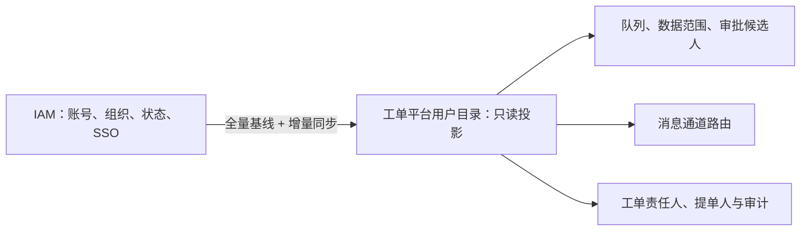
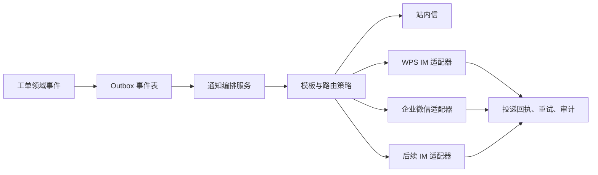

# 身份与消息通道设计

## 1. 结论

IAM 是身份、账号状态和组织机构的唯一权威源。工单系统不保存密码、不提供本地账号注册或组织编辑，也不将 IAM 用户复制为可独立维护的“本地用户”。

但系统必须保存一份**只读用户与组织投影**，即使启用 IAM 单点登录也不能省略。它用于授权计算、待办分派、主协办关系、组织数据范围、审批候选人、消息路由、审计和历史查询。

## 2. 身份模型

### 2.1 本地应保存的数据

| 数据 | 用途 | 维护方式 |
| --- | --- | --- |
| `iam_identity_id` | 不可变身份主键 | IAM 同步，不可人工修改 |
| 登录名、姓名、状态 | 展示、登录绑定、待办可用性 | IAM 同步 |
| 组织编码、组织路径、岗位、主管标识 | 数据范围、队列、审批候选人 | IAM 同步 |
| IAM 群组/岗位属性 | 服务台、二线组、审批角色识别 | IAM 同步或统一配置 |
| WPS IM / 企业微信成员标识 | 消息路由 | IAM 扩展字段或通道适配器解析 |
| 同步版本、来源时间、同步状态 | 追踪与故障补偿 | 系统维护 |

系统不保存 IAM 密码、访问令牌、可逆身份证明或用户可编辑的组织关系。

### 2.2 工单中的身份快照

工单保存 `requester_identity_id`、`assignee_identity_id` 等外键，同时在创建/转派/审批时记录姓名、组织名称、岗位、来源和时间的不可变快照。人员调岗、改名或离职后，历史工单仍能准确展示当时责任归属；当前权限则实时依据最新用户目录计算。

### 2.3 用户管理界面边界

平台提供“内部用户目录”，用于搜索、查看同步状态、所属组织、服务角色、可处理队列和消息可达性。该界面只读，不提供新建、删除、改密码或修改组织功能。异常处理仅支持重新同步、查看失败原因和跳转 IAM 处理。

## 3. 全量同步与 SSO

1. 首次导入 50,000 用户和全量组织，后续采用增量同步并定期全量校验。
2. SSO 启用后，OIDC/SAML 断言中的不可变 ID 必须与 `iam_identity_id` 绑定，禁止仅按姓名或登录名匹配。
3. 用户停用时立即禁止登录、抢单和新审批任务；历史记录不删除。进行中的责任工单交由队列主管按流程转派。
4. IAM 暂时不可用时，已登录会话是否允许短时续用由安全策略决定；禁止绕过 IAM 创建本地账号。

## 4. 消息通道架构

消息通道是可插拔适配器，不让工单领域代码直接依赖 WPS IM、企业微信或其他厂商 API。

### 4.1 统一通道契约

每个适配器只实现统一的 `send(NotificationRequest)`、`queryDelivery()` 和可选的 `resolveRecipient()` 契约。请求至少包括事件 ID、业务编号、接收人 IAM ID、通道成员 ID、模板编码、优先级、脱敏变量和幂等键。

支持的事件包括：建单、分派/抢单、转派、协办、评论、审批待办、SLA 预警/升级、解决、关闭、重开和集成失败。P1 升级、审批待办等关键通知应强制站内信加至少一个外部通道；普通提醒可由用户订阅偏好控制。

### 4.2 安全与可靠性

- WPS IM、企业微信等通道凭证加密存储，按环境隔离并支持轮换；不出现在工单正文、日志或前端页面。
- 外部回调必须验证签名、时间戳和来源；所有投递以事件 ID 幂等，采用指数退避、限流和死信队列。
- 通道不可用时不影响工单状态迁移，事件进入补偿队列，并以站内信或运维告警兜底。
- 模板变量按权限和数据分级脱敏，默认不发送附件正文、访问令牌、完整 IP、URL 敏感参数或业务敏感数据。
- 记录待发送、已发送、已送达、失败、重试和人工补偿等全链路审计。

### 4.3 接入顺序与 POC

一期：站内信与 WPS IM；二期：企业微信；后续以同一适配器协议扩展其他 IM。WPS IM 和企业微信上线前需确认其机器人/应用接口、身份映射字段、群聊能力、回执能力、单接口限额、网络白名单和签名机制，并以测试租户完成端到端投递 POC。
