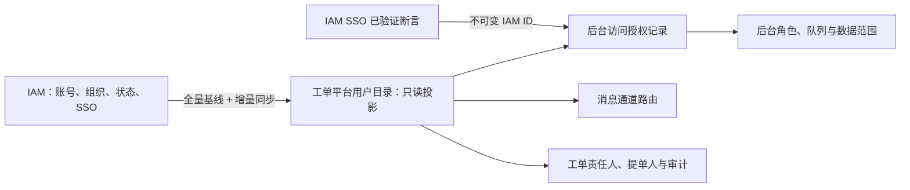
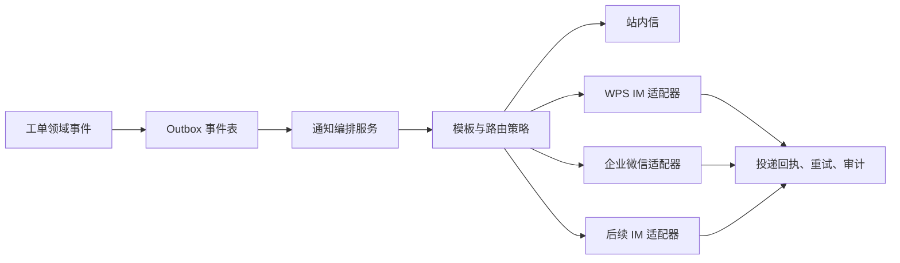

# 身份与消息通道设计

## 1. 结论

IAM 是身份、账号状态和组织机构的唯一权威源。工单系统不保存密码、不提供本地账号注册或组织编辑，也不将 IAM 用户复制为可独立维护的“本地用户”。所有经 IAM 登录且处于启用状态的人员，默认仅以普通提单人身份使用前台服务。

但系统必须保存一份**只读用户与组织投影**，即使启用 IAM 单点登录也不能省略。它用于授权计算、待办分派、主协办关系、组织数据范围、审批候选人、消息路由、审计和历史查询。

## 2. 身份模型

### 2.1 本地应保存的数据

| 数据 | 用途 | 维护方式 |
| --- | --- | --- |
| `iam_identity_id` | 不可变身份主键 | IAM 同步，不可人工修改 |
| 登录名、姓名、状态 | 展示、登录绑定、待办可用性 | IAM 同步 |
| 组织编码、组织路径、岗位、主管标识 | 数据范围、队列、审批候选人 | IAM 同步 |
| 后台访问授权 | IAM ID 是否可进入后台、后台启停状态、授权版本 | 平台后台管理员受控维护；不回写 IAM |
| 平台角色与数据范围 | 服务台、二线组、审批候选人、处理人资格和对象范围 | 仅由已授权后台人员配置；版本化、最小权限、审计 |
| WPS IM / 企业微信成员标识 | 消息路由 | IAM 扩展字段或通道适配器解析 |
| 同步版本、来源时间、同步状态 | 追踪与故障补偿 | 系统维护 |

系统不保存 IAM 密码、访问令牌、可逆身份证明或用户可编辑的组织关系。

### 2.2 工单中的身份快照

工单保存 `requester_identity_id`、`assignee_identity_id` 等外键，同时在创建/转派/审批时记录姓名、组织名称、岗位、来源和时间的不可变快照。人员调岗、改名或离职后，历史工单仍能准确展示当时责任归属；当前权限则实时依据最新用户目录计算。

### 2.3 用户管理界面边界

平台提供“内部用户目录”，用于搜索、查看同步状态、所属组织、服务角色、可处理队列和消息可达性。目录本身只读，不提供新建、删除、改密码或修改组织功能。另设独立的“后台人员授权”页面：管理员只能从已同步的启用 IAM 用户中选择 IAM ID，配置后台启停、平台角色和数据范围；不能编辑姓名、组织、密码或 IAM 账号状态。

后台授权必须满足以下边界：

- IAM ID 仅是已验证 SSO 主体的绑定键，不是可填写的登录凭据；登录成功后由服务端使用断言中的不可变 ID 查询授权记录。
- `REQUESTER` 为所有启用 IAM 用户的隐含基础角色，不能被后台撤销或单独授予；一线、二线、审批、服务经理、SLA 管理、审计和平台管理员等仅可授予后台人员。
- 授权变更必须记录操作者、目标 IAM ID、变更前后角色与数据范围、原因、时间和版本；禁止管理员修改自身权限，禁止移除最后一名平台管理员。平台管理员等高危角色应纳入双人复核策略。
- 人员在 IAM 停用、后台授权停用或角色撤销后立即失去新增处理、审批和管理能力；已登录会话在下一次服务端授权校验时收敛，历史工单与审计不删除。

## 3. 全量同步与 SSO

1. 首次导入 50,000 用户和全量组织，后续采用增量同步并定期全量校验。
2. SSO 启用后，OIDC/SAML 断言中的不可变 ID 必须与 `iam_identity_id` 绑定，禁止仅按姓名或登录名匹配；忽略断言中的业务角色声明，后台角色和数据范围仅以平台受控授权记录解析。
3. 用户停用、后台授权停用或其处理角色失效时立即禁止登录后台、抢单、被分派和新审批任务；历史记录不删除。进行中的责任工单交由队列主管按流程转派。
4. IAM 暂时不可用时，已登录会话是否允许短时续用由安全策略决定；禁止绕过 IAM 创建本地账号。

## 4. 消息通道架构

消息通道是可插拔适配器，不让工单领域代码直接依赖 WPS IM、企业微信或其他厂商 API。

### 4.1 统一通道契约

每个适配器只实现统一的 `send(NotificationRequest)`、`queryDelivery()` 和可选的 `resolveRecipient()` 契约。请求至少包括事件 ID、业务编号、接收人 IAM ID、通道成员 ID、模板编码、优先级、脱敏变量和幂等键。

支持的事件包括：建单、分派/抢单、转派、协办、评论、审批待办、SLA 预警/升级、解决、关闭、重开和集成失败。P1 升级、审批待办等关键通知应强制站内信加至少一个外部通道；普通提醒可由用户订阅偏好控制。

### 4.2 安全与可靠性

- WPS IM、企业微信等通道凭证加密存储，按环境隔离并支持轮换；不出现在工单正文、日志或前端页面。
- 外部回调必须验证签名、时间戳和来源；所有投递以事件 ID 幂等，采用指数退避、限流和死信队列。
- 通道不可用时不影响工单状态迁移，事件进入补偿队列，并以站内信或运维告警兜底。
- 模板变量按权限和数据分级脱敏，默认不发送附件正文、访问令牌、完整 IP、URL 敏感参数或业务敏感数据。
- 记录待发送、已发送、已送达、失败、重试和人工补偿等全链路审计。

### 4.3 接入顺序与 POC

一期：站内信与 WPS IM；二期：企业微信；后续以同一适配器协议扩展其他 IM。WPS IM 和企业微信上线前需确认其机器人/应用接口、身份映射字段、群聊能力、回执能力、单接口限额、网络白名单和签名机制，并以测试租户完成端到端投递 POC。

## 5. 当前实现映射

- 本地平台已保存 IAM 用户、组织、岗位的只读投影；本地开发初始化数据仅为虚构夹具，不能替代 IAM 同步。
- 已新增平台受控的“后台人员授权 + 角色 + 数据范围”记录（`platform_backoffice_user`、`platform_backoffice_user_role`、`platform_backoffice_user_data_scope`），替代开发期 `iam_user_role_projection` 作为处理人与审批候选人的角色依据。IAM 同步表只保存身份和组织；分派、转办、协办与交接的候选人必须同时是活动 IAM 用户、已启用后台人员且拥有活动支持角色。浏览器只提交候选 IAM ID，不能携带或伪造角色。
- 后台人员授权接口为 `GET/PUT /api/v1/admin/backoffice-access/{iamUserId}`：仅平台管理员可调用，读取和写入均校验 IAM 用户启用状态；更新使用乐观锁、禁止修改自身、禁止移除最后一名平台管理员，并产生审计事件。接口与页面不接受 IAM 密码、令牌、姓名或组织写入字段。
- 已提供可选 OIDC 登录接入：仅在部署配置 `SERVICEHUB_IAM_SSO_ENABLED=true` 且提供标准 Spring OAuth2 Client 注册信息后启用。成功回调只读取受配置保护的不可变主体字段（默认 `sub`），将其置换为服务端 `VerifiedIamAuthentication` 会话；每次领域操作重新解析 IAM 启用状态、本地后台角色与数据范围，不采信 ID Token/UserInfo 中的业务角色声明。SAML 适配器须复用同一受验证主体工厂。
- MySQL 生产部署使用追加式 `audit_event` 表持久化审计证据（操作、主体、请求 ID、资源、时间和非敏感属性）；应用账户不得拥有该表的更新/删除权限。审计持久化失败会向调用方抛错；已在事务中的工单创建、工作流动作、公告和 SLA 管理会随事务失败，避免出现“已变更但无审计证据”。本地开发使用日志审计替代，不能作为生产留存证明。
- 工单创建、分派和处理历史保留 IAM ID 与身份快照；详情页展示提交时快照而不以当前调岗信息覆盖历史。
- “我的待阅”从当前 IAM 用户的未读站内通知反查关联工单；它不代表处理权限，打开工单时仍需执行对象授权。
- 通知表、投递表和 Outbox 已作为持久化边界存在；WPS IM 通道配置默认禁用，未录入任何真实凭据或生产通道地址。
- 关联工单不以 IAM 组织字段作浏览器侧过滤依据：创建时当前身份须同时拥有源单修改权和目标单读取权；读取关联列表时仍逐条确认目标当前可见性。这样既能支持跨部门协同，也避免通过工单编号或历史关联反向枚举人员、组织或工单数据。
